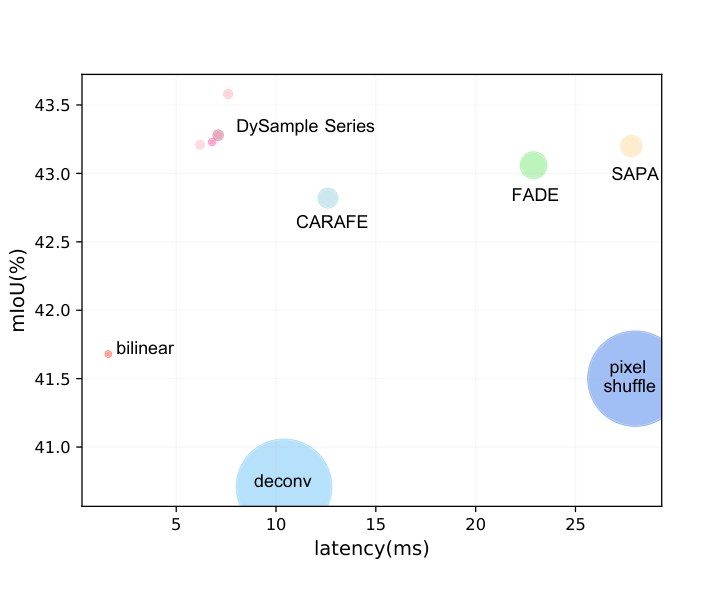
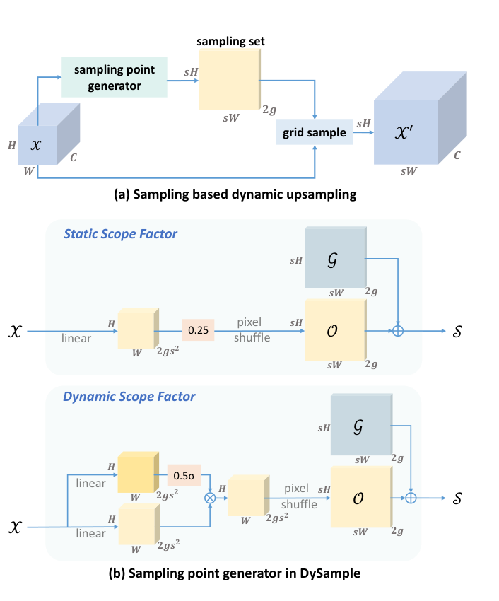
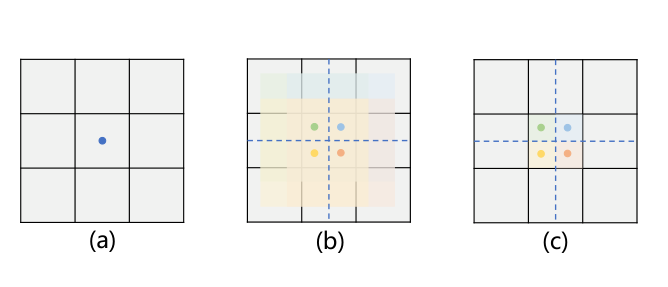
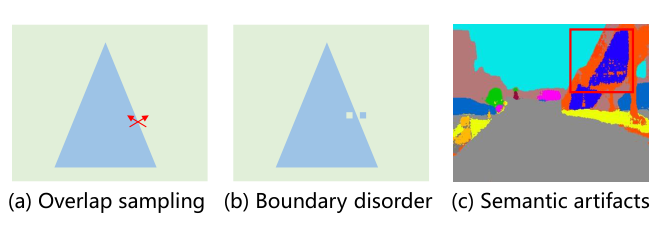
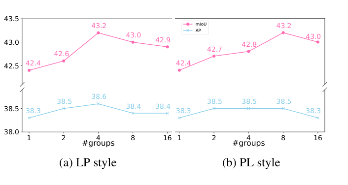
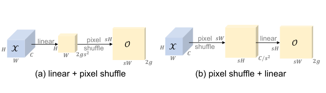
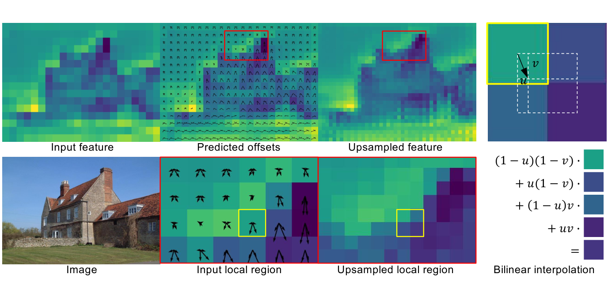
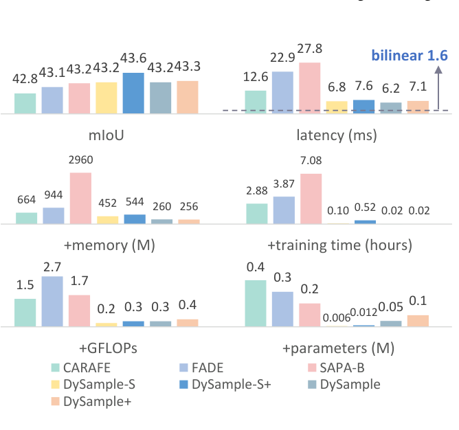
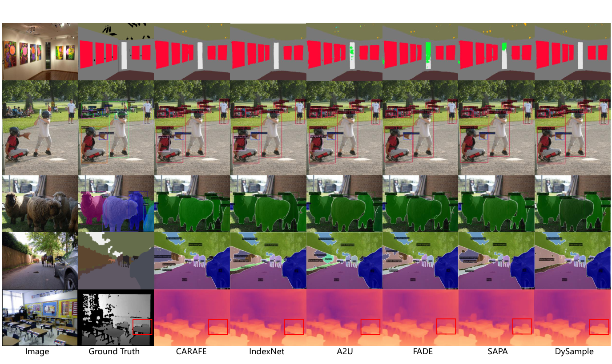

# DySample：Learning to Upsample by Learning to Sample

Paper Reading 是从个人角度进行的一些总结分享，受到个人关注点的侧重和实力所限，可能有理解不到位的地方。具体的细节还需要以原文的内容为准，博客中的图表若未另外说明则均来自原文。

| 论文概况 | 详细 |
| --- | --- |
| 标题 | 《Learning to Upsample by Learning to Sample》 |
| 作者 | Wenze Liu、Hao Lu、Hongtao Fu、Zhiguo Cao |
| 发表会议 | ICCV |
| 会议等级 | CCF-A |
| 发表年份 | 2023 |
| 论文代码 | [https://github.com/tiny-smart/dysample](https://github.com/tiny-smart/dysample) |

作者单位：

1. 华中科技大学人工智能与自动化学院（School of Artificial Intelligence and Automation, Huazhong University of Science and Technology）

## 研究动机

特征上采样（Feature Upsampling）是密集预测模型中逐步恢复特征分辨率的关键环节，其质量直接决定逐像素预测的精度，导致编码器-解码器结构普遍要面对「低分辨率特征如何高质量放大」的问题。最常用的最近邻插值与双线性插值按固定规则取值，完全忽略特征图中的语义信息。为了增加灵活性，反卷积与 Pixel Shuffle 等可学习上采样器被引入，但反卷积存在棋盘伪影，Pixel Shuffle 则对高层任务并不友好。动态上采样器进一步引入内容感知机制：CARAFE 用子网络生成内容感知的动态卷积核来重组特征；后续的 FADE 与 SAPA 又把高分辨率引导特征与低分辨率输入特征一起送入核生成过程，让上采样被高分辨率结构引导。然而这些核范式方法结构复杂，依赖耗时的动态卷积，需要定制的 CUDA 实现，推理开销远高于双线性插值；FADE 与 SAPA 对高分辨率引导特征的依赖还带来了额外计算量，并缩小了适用场景。另一方面，现代架构普遍采用多尺度特征设计，以 FPN 为例，高分辨率特征本来就会在上采样之后与低分辨率特征相加融合，上采样器单独摄入高分辨率特征的必要性存疑。至此问题收窄为：暂未有工作在仅需低分辨率单输入的前提下，同时做到接近插值算子的开销与动态上采样器的精度。

## 文章贡献

针对核范式动态上采样器开销大、依赖高分辨率引导特征的问题，本文提出了 DySample，一个超轻量且有效的动态上采样器。其核心是绕开动态卷积，从点采样（point sampling）的视角重新形式化上采样：把输入特征视为经双线性插值后的连续特征图，为每个上采样点生成内容感知的采样偏移，再用 PyTorch 内置的 grid sample 函数对连续特征图重采样。首先本文给出朴素实现，用线性层逐点生成偏移并完成重采样；接着通过控制初始采样位置、约束偏移移动范围、按通道分组三个逐步的改进强化其上采样行为；最终依据范围因子的形式（静态/动态）与偏移生成风格（LP/PL）组合出四个变体。实验表明，DySample 在语义分割、目标检测、实例分割、全景分割与单目深度估计五个密集预测任务上均优于已有上采样器，同时所需参数量、FLOPs、GPU 显存与延迟大幅低于 CARAFE、FADE、SAPA 等先前方法。

## 本文方法

### 从点采样视角看上采样

上采样本质上是对几何信息的建模，本文把上采样回归为其本源——点采样。给定大小为 $C \times H_1 \times W_1$ 的特征图 $X$ 与大小为 $2 \times H_2 \times W_2$ 的采样集 $S$（第一维的 2 表示 $x$ 与 $y$ 坐标），grid sample 函数用 $S$ 中的位置对假想的双线性插值后连续特征图重采样，得到大小为 $C \times H_2 \times W_2$ 的 $X'$，定义如下：

$$X' = \mathrm{grid\ sample}(X, S)$$

其中 $X$ 是低分辨率输入特征，$S$ 是采样位置集合，$X'$ 是重采样后得到的高分辨率特征。直观上，只要采样位置取得足够「懂内容」，无需动态卷积也能完成内容感知的上采样。

朴素实现很直接：给定上采样倍率 $s$ 与特征图 $X$，用一个输入输出通道数为 $C$ 和 $2s^2$ 的线性层生成偏移，再经 Pixel Shuffle 重排为 $2 \times sH \times sW$，偏移 $O$ 与采样集 $S$ 的计算为：

$$O = \mathrm{linear}(X)$$

$$S = G + O$$

其中 $O$ 是逐点生成的偏移，$G$ 是标准的规则采样网格。整个数据流如下图所示，采样点生成器产出采样集后，grid sample 直接输出上采样特征。

这个初步设计在 Faster R-CNN 上取得 37.9 AP，在 SegFormer-B1 上取得 41.9 mIoU，与 CARAFE（38.6 AP、42.8 mIoU）尚有差距，说明朴素的偏移生成还不足以支撑高质量的上采样，接下来的改进都围绕它展开。

### 初始采样位置

朴素实现的问题是 $s^2$ 个上采样点共享同一个初始位置（即 $X$ 中的标准网格点），彼此的位置关系被忽略，初始采样位置分布不均；若生成的偏移全为零，上采样结果等价于最近邻插值，因此这种初始化可称为「nearest 初始化」。改进方案是把初始位置改为「bilinear 初始化」，让 $s^2$ 个采样点的初始位置按双线性插值的方式均匀分布，此时零偏移恰好还原双线性插值的结果。两种初始化对应的采样点分布与偏移范围如下图所示。

更换初始采样位置后，性能提升至 38.1（+0.2）AP 与 42.1（+0.2）mIoU。这一步只改动初始化方式，未引入任何参数，它输出的偏移将进一步被送入范围约束环节。

### 偏移范围与静态范围因子

由于归一化层的存在，输出特征的取值通常落在以 0 为中心的 $[-1, 1]$ 区间，局部 $s^2$ 个采样点的走动范围因此会显著重叠。重叠会使边界附近的点值变得混乱，误差逐级传播后在输出中形成语义伪影，如下图所示。

缓解办法是给偏移乘上一个 0.25 的系数，该值恰好满足重叠与不重叠之间的理论边界条件，称为「static scope factor」，偏移公式被修改为：

$$O = 0.25\ \mathrm{linear}(X)$$

其中 0.25 把采样点的走动范围局部约束在相邻网格单元内。设置 0.25 后性能提升至 38.3（+0.2）AP 与 42.4（+0.3）mIoU。这种乘法是一个软约束，无法彻底消除重叠；用 tanh 把偏移硬约束在 $[-0.25, 0.25]$ 反而更差，显式约束限制了表达能力，比如某些位置需要大于 0.25 的偏移时就无法处理。

### 特征分组

分组的目标是让不同通道子空间各自拥有独立的采样集：沿通道维把特征图分成 $g$ 组，每组生成一份偏移。分组消融的曲线如下图所示，LP 与 PL 两种风格下，增大分组数都能持续涨点。

当 $g = 4$ 时，性能达到 38.6（+0.3）AP 与 43.2（+0.8）mIoU，是三步改动中收益最大的一步。分组之后，每个通道组内的偏移生成还要面对「先线性还是先重排」的选择，这引出下文的生成风格设计。

### 动态范围因子

静态因子是全局固定的，灵活性有限。为进一步放开偏移的尺度，本文用线性投影逐点生成「dynamic scope factor」：通过 sigmoid 函数与 0.5 的系数，动态范围的取值落在 $[0, 0.5]$、以 0.25 为中心，与静态版本的中心一致。偏移公式进一步被修改为：

$$O = 0.5\ \mathrm{sigmoid}(\mathrm{linear}_1(X)) \cdot \mathrm{linear}_2(X)$$

其中 $\mathrm{linear}_1$ 生成逐点的动态范围因子，$\mathrm{linear}_2$ 生成原始偏移，二者逐元素相乘实现自适应缩放。动态范围因子再把性能推高至 38.7（+0.1）AP 与 43.3（+0.1）mIoU。至此偏移生成的完整结构如下图的 (b) 部分所示，静态版本与动态版本共享「生成偏移、与网格相加得到采样集」的流程。

### 偏移生成风格与四个变体

偏移生成存在两种风格。前面的设计先用线性投影产出 $s^2$ 组偏移、再重排以满足空间尺寸，称为「linear + pixel shuffle」（LP）；反过来先重排再线性投影的版本称为「pixel shuffle + linear」（PL），其参数量可降至 LP 的 $1/s^4$，但 PL 需要额外存储重排后的特征，显存与延迟略高。两种风格的结构对比如下图所示。

综合范围因子的形式与生成风格，本文考察四个变体：LP 风格配静态因子的 DySample、LP 风格配动态因子的 DySample+、PL 风格配静态因子的 DySample-S、PL 风格配动态因子的 DySample-S+。实验中按经验取 LP 版本分组数为 4、PL 版本为 8；PL 版本在 SegFormer 与 MaskFormer 上更好，但在其余测试模型上略差。

### 工作机制与相关工作的关系

DySample 的上采样过程如下图所示：边界上的一个低分辨率点经预测偏移被划分为四个上采样点，其中左上角的点被划分到「天空」，其余三个被划分到「房子」，从而让边缘更清晰；右子图展示了右下角上采样点如何由双线性插值合成。

与 CARAFE 相比，DySample 生成的是上采样位置而非卷积核：在核范式视角下 DySample 等价于使用 $2 \times 2$ 的双线性核，而 CARAFE 至少需要 $3 \times 3$ 的核尺寸，GFLOPs 因此至少是 DySample 的 2.25 倍。与 SAPA 相比，偏移生成同样可视为为每个点寻找语义相似的区域，但 DySample 不需要引导图，更高效也更容易使用。与可变形注意力相比，后者在每个位置采样多个点聚合成新点以增强特征，而 DySample 面向上采样、每个上采样位置只采一个点，把一个点划分为 $s^2$ 个点——只要这 $s^2$ 个点能被动态划分，单点采样就足够了。

## 实验结果

### 实验设置

论文在五个密集预测任务上评测：ADE20K 语义分割（SegFormer-B1 与 MaskFormer，mIoU 与 bIoU）、MS COCO 目标检测与实例分割（Faster R-CNN 与 Mask R-CNN，AP 系列）、MS COCO 全景分割（Panoptic FPN，PQ/SQ/RQ）以及 NYU Depth V2 单目深度估计（DepthFormer-SwinT）。对比的上采样器包括 bilinear、反卷积、Pixel Shuffle、CARAFE、IndexNet、A2U、FADE 与 SAPA-B，实验仅替换模型中的上采样阶段，其余训练设置保持不变。

### 定量对比

五大任务的主结果可汇总为下表，数值取自原文 Table 4–9，加粗为该任务最优。

| 任务 / 基线 | 指标 | Bilinear | CARAFE | FADE | SAPA-B | DySample 系列最优 |
| --- | --- | --- | --- | --- | --- | --- |
| SegFormer-B1（ADE20K） | mIoU | 41.68 | 42.82 | 43.06 | 43.20 | **43.58**（DySample-S+，+1.90） |
| Faster R-CNN R50（COCO） | AP | 37.5 | 38.6 | 38.5 | 37.8 | **38.7**（DySample+） |
| Mask R-CNN R50（COCO） | Mask AP | 34.7 | 35.4 | 35.1 | 35.1 | **35.7**（DySample+） |
| Panoptic FPN R50（COCO） | PQ | 40.2 | 40.8 | 40.9 | 40.6 | **41.5**（DySample+） |
| DepthFormer-SwinT（NYU） | $\delta < 1.25$ | 0.873 | 0.877 | 0.874 | 0.870 | **0.878**（DySample+） |

更换更强骨干后结论不变：MaskFormer 上 mIoU 从 52.70 提升至 53.91（+1.21，Swin-B）、从 54.10 提升至 54.90（+0.80，Swin-L）；Faster R-CNN 从 R50 到 R101 分别带来 +1.2 与 +1.1 的 box AP 提升。另一方面，SegFormer-B1 上 DySample 系列的 bIoU（29.12–29.93）低于 FADE（31.68）与 SAPA-B（30.96），可见 DySample 的增益主要来自内部区域，而引导类上采样器主要改善边界质量。

### 消融与效率

从朴素实现到最终版本，每一步改动的增益都可追溯：bilinear 初始化 +0.2、静态范围因子 +0.2 至 +0.3、分组 +0.3 至 +0.8、动态范围因子 +0.1，逐步把 41.9 mIoU / 37.9 AP 推到 43.3 mIoU / 38.7 AP。复杂度对比如下图所示，测试输入为 $256 \times 120 \times 120$ 的特征图。

DySample 系列的推理延迟为 6.2–7.6 ms，逼近双线性插值的 1.6 ms，且在延迟、训练显存、训练时长、GFLOPs 与参数量五个维度上都是强动态上采样器中最低的。以 MaskFormer-SwinB 为例，DySample 带来的性能提升比 CARAFE 高 46%，但参数量仅为 CARAFE 的 3%、FLOPs 为其 20%。系列内部，-S 版本参数量与 GFLOPs 更低，但显存与延迟略高；+ 版本引入少量额外计算量。

### 可视化分析

五大任务的定性对比如下图所示，自上而下依次为语义分割、目标检测、实例分割、全景分割与深度估计。

语义分割中 DySample 的输出与 CARAFE 相近但在边界附近更干净，引导类上采样器边界更锐利却在内部区域出现错误预测；深度估计中 DySample 给出准确且一致的椅子深度图，验证了其在恢复细节与保持平坦区域一致性上的优势。

## 优点和创新点

个人认为，本文有如下一些优点和创新点可供参考学习：

1. 把上采样重新形式化为点采样而非动态卷积，绕开了核范式与定制 CUDA 包，仅凭 PyTorch 内置的 grid sample 函数即可实现内容感知的动态上采样，工程可用性与部署友好度极高。
2. 轻量特性极为突出，仅以数万级的参数增量在五个密集预测任务上全面超越 CARAFE、FADE、SAPA，同时延迟逼近双线性插值，可以安全替换现有密集预测模型中的 NN/bilinear 插值，说服力强。
3. 「朴素设计 + 逐步改进」的研究范式清晰可复用，每一步改动（初始化、范围约束、分组、动态因子）都有动机解释与消融数据支撑，实验丰富，值得在改进类工作中模仿。

## 局限与批判性讨论（此节为偏离语料的增补）

1. 边界质量不敌引导类上采样器。SegFormer-B1 上 DySample 系列的 bIoU（29.12–29.93）全面低于 FADE（31.68）与 SAPA-B（30.96），说明其对内部区域的改善大于边界；对边界敏感的任务（如深度抠图、医学影像分割），引导类方法仍有一席之地。
2. 并非所有任务都有一致收益。单目深度估计上 DySample+ 仅带来 +0.05 的 $\delta < 1.25$ 与 -0.04 的 Abs Rel 改善，且 DySample-S 的 $\delta < 1.25$（0.871）反而低于 bilinear（0.873），变体选择不当可能无增益。
3. 变体与超参依赖经验调参。PL 版本在 SegFormer 与 MaskFormer 上更好、在其余模型上略差，分组数按经验取 LP 为 4、PL 为 8，实际使用时仍需针对自己的骨干做一轮消融。
4. 评测范围限于 $\times 2$ 上采样与 FPN 类融合结构，更大上采样倍率以及与其它特征融合方式的组合效果在原文中未获取。

</content>
</invoke>
