# 5%>100%: Breaking Performance Shackles of Full Fine-Tuning on Visual Recognition Tasks

Paper Reading 是从个人角度进行的一些总结分享，受到个人关注点的侧重和实力所限，可能有理解不到位的地方。具体的细节还需要以原文的内容为准，博客中的图表若未另外说明则均来自原文。

| 论文概况 | 详细 |
| --- | --- |
| 标题 | 《5%>100%: Breaking Performance Shackles of Full Fine-Tuning on Visual Recognition Tasks》 |
| 作者 | Dongshuo Yin, Leiyi Hu, Bin Li, Youqun Zhang, Xue Yang |
| 发表会议 | IEEE/CVF Conference on Computer Vision and Pattern Recognition (CVPR) |
| 会议等级 | CCF-A |
| 发表年份 | 2025 |
| 论文代码 | [https://github.com/Leiyi-Hu/mona](https://github.com/Leiyi-Hu/mona) |

作者单位：

1. Department of Automation, Shanghai Jiao Tong University
2. BNRist, Department of Computer Science and Technology, Tsinghua University
3. University of Chinese Academy of Sciences
4. Alibaba Group

## 研究动机

视觉识别任务长期以来依赖「预训练 + 全微调」范式：在 ImageNet-22k 等大规模数据集上训练得到的 Swin Transformer 等骨干，被下游任务以全部参数参与梯度更新的方式迁移到目标检测、实例分割、语义分割等任务上。然而，大模型时代下全微调的存储与计算成本持续攀升，单个 SwinV2-G 推理就要占用 4 GB 存储，远超一般移动端 App 的容量预算。Delta-tuning（参数高效微调 PEFT）以不到 5% 的可训练参数逼近甚至匹配全微调的性能，在 NLP 中已得到广泛验证，并被划分为三类范式：固定部分层并微调其余（如 BitFit、NormTuning、Partial-1）、对原参数做低秩重参数化（如 LoRA）、以及固定骨干并新增可训练适配器（prompt 系列与 adapter 系列）。视觉侧的 delta-tuning 自 VPT、AdaptFormer、LoRand 等工作以来虽在分类任务上接近全微调，但仍未在复杂稠密预测任务上系统突破全微调的性能上限。这一层面存在三个具体局限：一是现有视觉适配器（Adapter、AdaptFormer、LoRand 等）的内部结构沿用 NLP 的线性滤波器（down-projection、非线性激活、up-projection），未针对视觉信号天然具有的二维空间局部性与多尺度特性做改造；二是单一下游层将上游特征压缩到同一个语义空间，缺乏多尺度/多认知维度的并行处理；三是对不同 PEFT 范式之间的优劣缺乏在统一视觉基准下的对照，导致实际工程难以取舍。综上，亟需一种面向视觉信号的、以参数高效为目标的多认知适配器，以替代全微调成为视觉迁移学习的更优解。

## 文章贡献

针对视觉 delta-tuning 未能在稠密预测任务上系统突破全微调性能上限这一局限，本文提出了多认知视觉适配器（Multi-cognitive Visual Adapter，Mona）调优范式。其核心是将面向自然语言的线性适配器改造为面向视觉信号的多尺度卷积适配器，并辅以输入分布归一化以稳定上游特征。首先在 Swin Transformer 每个 Block 的 MSA 与 MLP 之后并行插入一个 Mona 模块，并固定骨干参数仅更新 Mona 与下游任务头；其次在 Mona 入口通过缩放层归一化（LayerNorm + 两个可学习缩放因子）调整从固定层传入的特征分布；接着采用核大小 3×3、5×3、5×5、7×7 的三路深度可分离卷积以多认知视角处理上游特征，并由 1×1 卷积聚合；最终配合 GeLU 非线性激活与上投影完成特征还原。实验表明 Mona 在 COCO 实例分割、Pascal VOC 目标检测、ADE20K 语义分割、DOTA/STAR 有向目标检测以及三类分类任务上均超越全微调，以低于 5% 的可训练参数取得了 1% 到 3.6% 不等的精度提升，是目前唯一在所有代表性视觉任务上均超越全微调的适配器类方法。

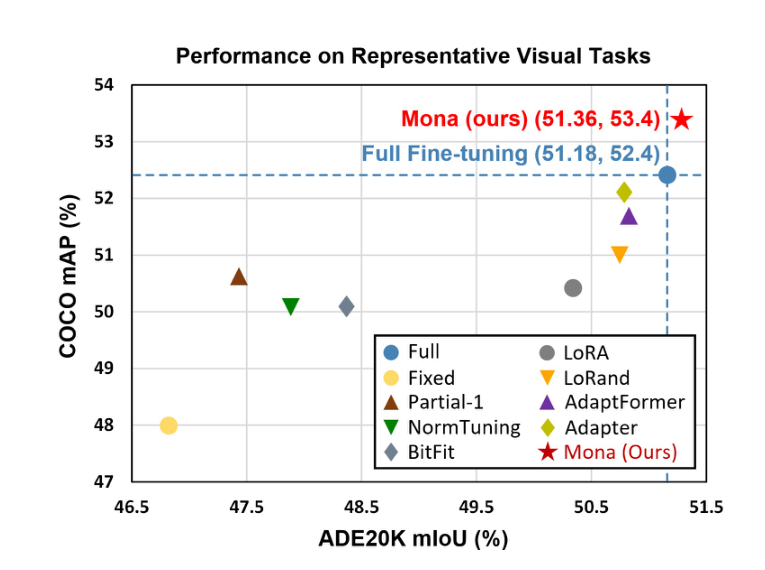

## 本文方法

### 全微调与适配器微调的优化目标

Mona-tuning 建立在 adapter-tuning 范式之上。给定数据集 $D = \{(x_i, y_i)\}_{i=1}^{N}$，全微调同时优化整个框架的参数 $\theta$，而 adapter-tuning 固定预训练骨干参数 $\theta_F$，仅更新适配器与骨干之外的参数 $\omega$。两种范式的优化目标分别定义为：

$$\theta \leftarrow \arg\min_{\theta} \mathrm{loss}(D, \theta)$$

$$\omega \leftarrow \arg\min_{\omega} \mathrm{loss}(D, \theta_F, \omega)$$

其中 $\mathrm{loss}$ 为训练损失，$\theta$ 表示整个框架的可训练参数，$\theta_F$ 为 adapter-tuning 中被固定的参数，$\omega$ 为 adapter-tuning 中实际更新的参数（含适配器内部与骨干之外的任务头）。该形式化将全微调与适配器微调的差异归到「固定 $\theta_F$、更新 $\omega$」这一对偶结构上，是后续 Mona 模块设计的起点。

### 输入优化：缩放层归一化

典型线性适配器把上游固定层的输出直接送入 down-projection，但是固定层无法针对新任务调整其分布，导致进入适配器的输入特征存在偏置，进而影响下游卷积滤波器的稳定性。本文在 Mona 模块的最顶端引入归一化层与两个可学习缩放因子 $s_1$、$s_2$，以同时调节来自固定层输入的分布与占比。该步骤的计算形式化为：

$$x_{\mathrm{norm}} = s_1 \cdot |x_0|_{\mathrm{LN}} + s_2 \cdot x_0$$

其中 $|\cdot|_{\mathrm{LN}}$ 表示 LayerNorm 操作，$x_0$ 是 Mona 模块的原始输入。原文在实践中发现 LayerNorm 优于 BatchNorm，因此采用 LN 而非 BN。这一改动为下游的多认知滤波器提供了分布稳定、且保留原始信息的输入。

### 多认知视觉滤波器：多尺度 DWConv + 1×1 聚合

视觉信号与文本信号在结构上有本质差异：图像在不同尺度上承载着互补的局部信息，单一线性滤波器难以同时建模多尺度上下文。本文借鉴 Inception 系列的多尺度并行卷积思路，将三种核大小（$3 \times 3$、$5 \times 5$、$7 \times 7$）的深度可分离卷积（Depth-Wise Convolution，DWConv）并联在 down-projection 之后，通过通道级参数共享的轻量化策略控制额外参数量；其后以 $1 \times 1$ 卷积（点卷积 PWConv）聚合并在两个层级都加跳连，其形式化为：

$$f_{\mathrm{dw}} = x + \mathrm{avg}\!\left(\sum_{i=1}^{3} \omega_{\mathrm{dw}}^{i} \,\hat{\otimes}\, x\right)$$

$$f_{\mathrm{pw}} = x + \omega_{\mathrm{pw}} \otimes x$$

其中 $\hat{\otimes}$ 表示深度可分离卷积，$\otimes$ 表示点卷积；三路 DWConv 的结果先做平均再送入 PWConv，并在两个层级都引入残差。多尺度并行 + 平均后再聚合的设计，使 Mona 在不显著增大参数量的前提下获得了多认知维度。

### Mona 的整体计算流程

将以上三步串联起来，Mona 模块从输入到输出的整体计算公式为：

$$x' = x_0 + U^l \, \sigma\!\left(f_{\mathrm{pw}}\!\left(f_{\mathrm{dw}}\!\left(D^l(x_{\mathrm{norm}})\right)\right)\right)$$

其中 $D^l$ 与 $U^l$ 分别为第 $l$ 个适配器的下投影与上投影，$\sigma$ 表示 GeLU 激活。流程上 $x_0$ 先经 LN-缩放得到 $x_{\mathrm{norm}}$，再由下投影压缩到低维空间，由多尺度 DWConv-平均-1×1 卷积完成特征聚合与非线性化，最后通过上投影还原并与原输入相加完成残差。该流程对应原文图 2（右）的 Mona Layer：底部 LN + $s_1$/$s_2$ → Down Projection → $3 \times 3$/$5 \times 5$/$7 \times 7$ DW 平均 → 1×1 Conv → GeLU → Up Projection，全程共四处跳连。

### 参数量分析

设适配器输入维度为 $m$、压缩后维度为 $n$，则各部分的可训练参数分别为：LN 与缩放因子 $2m + 2$；两个线性层（下投影与上投影）共 $2mn + m + n$；三路 DWConv 共 $(3^2 + 5^2 + 7^2)n = 83n$；PWConv 为 $n^2$。汇总后每个 Mona 模块的参数量为：

$$(2n + 3)m + n^2 + 84n + 2$$

由于每个 SwinBlock 中在 MSA 后与 MLP 后各插入一个 Mona，因此每个 Block 共计两份上述参数。原文固定 $n = 64$ 以控制参数规模。

### Mona 在 SwinBlock 中的插入位置

Mona 的插入方式与 AdaptFormer 等并行适配器一致，但相比 LoRand 同时串联两条路径，本文采用「并行 + 跳连」的简化结构。具体地，每个 SwinBlock 在 MSA 和 MLP 之后各放置一个 Mona，并以残差加回原分支，使得原始表征能力被完整保留。下图给出了整体插入位置（左）与 Mona 内部细节（右）。Mona-tuning 在训练阶段固定骨干与原 MSA/MLP 参数，仅更新 Mona 与下游检测/分割头，从而将可训练参数控制在骨干参数的 5% 以内。

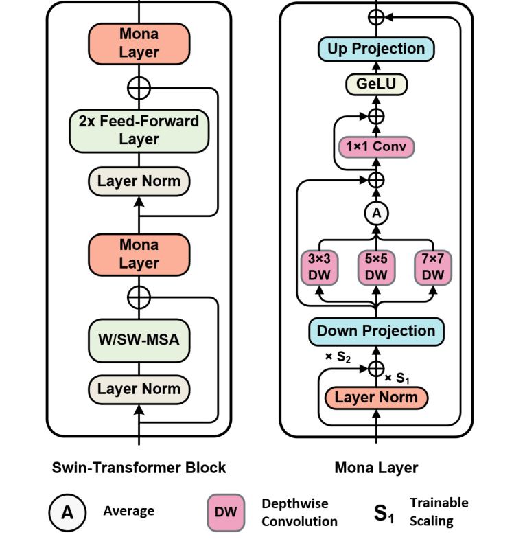

## 实验结果

### 实验设置

本文在五个代表性数据集上评估：实例分割 MS COCO、目标检测 Pascal VOC 0712、语义分割 ADE20K、图像分类 Oxford 102 Flower / Oxford-IIIT Pet / VOC2007、以及有向目标检测 DOTA-v1.0 与 STAR。骨干统一采用 ImageNet-22k 预训练的 Swin Transformer 系列：COCO、DOTA、STAR 使用 Swin-B（89M），其他任务使用 Swin-L（198M）。评估指标方面，检测任务使用 APBox，分割任务使用 mIoU 或 APMask/APBox，分类任务报告 top-1 与 top-5 准确率。基线被分为两组：「不引入额外结构」组（FULL、FIXED、BitFit、NormTuning、Partial-1）与「引入额外结构」组（Adapter、LoRA、AdaptFormer、LoRand）。所有 adapter 类方法的中间维度固定为 64，工具链基于 MMDetection、MMSegmentation、MMRotate、MMClassification。

### 实例分割与稠密预测对比

COCO 是最具挑战性的任务之一。Mona 在 COCO 实例分割上以 4.16M（占骨干 4.67%）的可训练参数取得 APBox 53.40%（+1.00%）与 APMask 46.00%（+0.90%），是表中唯一超过全微调的方法。如下表所示，Mona 同时超过了所有引入额外结构的 PEFT 基线，验证了多认知视觉滤波器相对单纯线性适配器的优势。可见，可训练参数最多的 Partial-1（14.53%）性能反而低于参数量仅 5.23% 的 LoRand 与仅 4.67% 的 Mona，说明 PEFT 的性能与参数规模并无单调关系，模块设计本身比参数占比更关键。

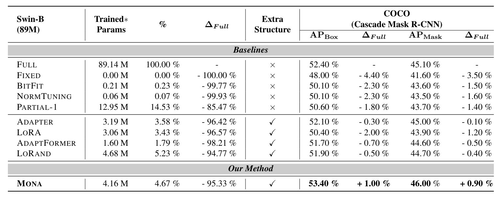

在 Pascal VOC 目标检测与 ADE20K 语义分割上，Mona 仍以最低的训练参数（VOC 上 2.56%、ADE20K 上 2.56%）领先所有基线，VOC 上 APBox 87.30% 较全微调提升 3.60%，ADE20K 上 mIoU 51.36% 提升 0.18%。如下表所示，Pascal VOC 上所有 PEFT 方法均超过全微调，这被作者解释为「低资源场景下全微调 198M 大模型容易过拟合，而 delta-tuning 固定骨干可缓解」。

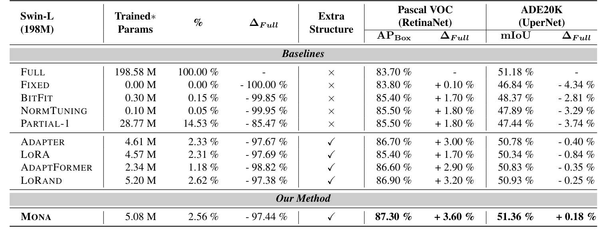

### 图像分类与有向目标检测对比

在三类分类数据集上，Mona 在 Flowers102、OxfordPets 上均取得最高 top-1，并达到全局平均 94.0413%（top-1）/99.7592%（top-5）的最佳结果。如下表所示，所有 PEFT 方法的平均 top-1 均超过全微调，这与「简单任务上 delta-tuning 已经接近全微调」的先前结论一致；而密集预测任务才能更明显地区分不同调优方法的优劣。

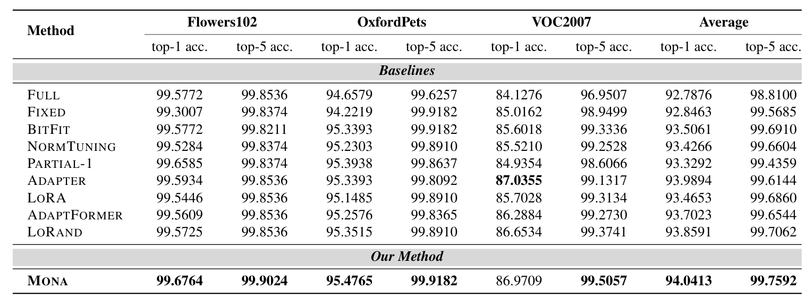

在更具挑战性的有向目标检测任务上（DOTA-v1.0/STAR），Mona 在 Oriented R-CNN、KLD、H2RBox-v2 三类检测框架中均取得最高 AP。如下表所示，例如 STAR 上 Oriented R-CNN 取得 39.45%（+0.82%）、H2RBox-v2 上取得 31.34%（+1.05%）。这一组实验进一步证明 Mona-tuning 的适配能力不依赖于具体检测头，对旋转框与角度回归具有良好迁移性。

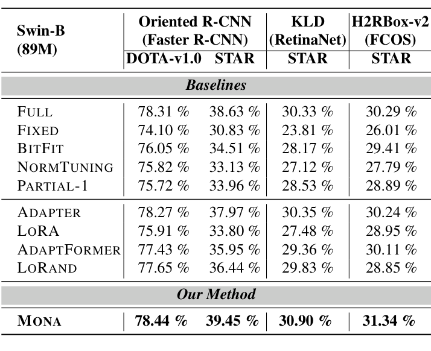

### 损失收敛与可视化分析

下图给出了 Mona 与五个代表基线在 Pascal VOC 上的训练损失曲线。可见 Mona（橙线）收敛速度最快且最终损失最低，其在第 1500–1800 轮放大区域内的训练损失明显低于 AdaptFormer、Adapter、LoRA 等其他 PEFT 基线，并且低于全微调（紫色实线）。损失曲线表明，多认知视觉滤波器确实帮助 Mona 更快地学到稳定的视觉表征，这与上文 mAP 上的优势形成因果一致的证据链。

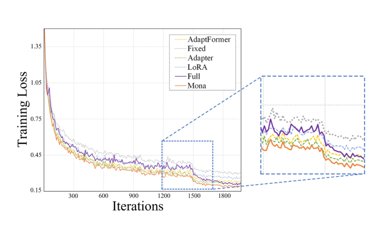

### 消融与跨框架扩展性

中间维度消融（Table 5）：32 / 64 / 128 维分别取得 86.8% / 87.3% / 87.1% 的 APBox，参数占比 1.35% / 2.56% / 5.22%。64 维为最佳，证实适配器容量并非越大越好，与 AdaptFormer 在分类任务上的结论一致。

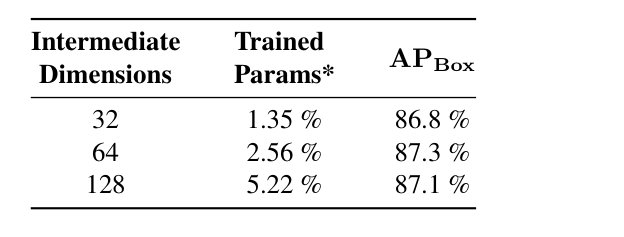

骨干尺寸消融（Table 6）：Swin-T/B/L 三个尺寸下 Mona 分别取得 83.5% / 86.5% / 87.3%，相对全微调 80.1% / 81.6% / 83.7% 的一致提升；且骨干越大 Mona 的相对参数量越小（Swin-T 上 4.87% → Swin-L 上 2.56%），表明 Mona 在大模型时代具备更强的参数效率优势。

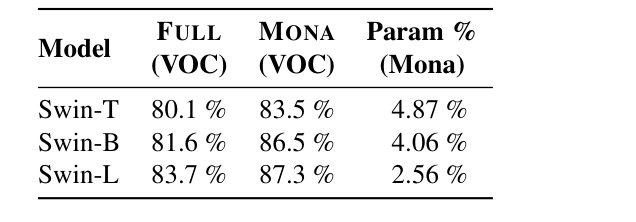

结构细节消融（Table 7）：第一行 ×[3,5,7] 为 86.9%，加入缩放归一化后 ✓[3,5,7] 提升至 87.3%，验证了缩放归一化的有效性；其余六行对比不同卷积核设置，[3,5,7] 在所有组合中取得最佳，说明过大核（[7]）与冗余核（[3,3,3]）均会带来性能下降。

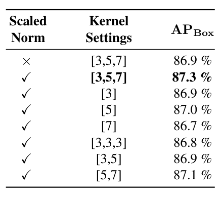

跨框架泛化（Table 8）：将 Mona 迁移到 PVT-Large 骨干上，在 Pascal VOC 上 APBox 仍达 80.3%，超过 AdaptFormer（79.2%）与 LoRand（79.3%）等竞争基线，说明 Mona 的设计不绑定于 Swin 架构，对金字塔 ViT 类骨干同样有效。

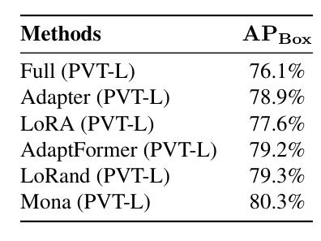

## 优点和创新点

个人认为，本文有如下一些优点和创新点可供参考学习：

1. 将面向自然语言的线性适配器改造为多尺度深度可分离卷积的多认知视觉适配器，并以 3×3、5×5、7×7 三路并联 + 1×1 聚合的方式增强视觉信号建模，在不显著增大参数量的前提下突破了视觉 delta-tuning 的性能上限；
2. 在适配器入口引入 LayerNorm + 可学习缩放因子 $s_1$、$s_2$ 的输入优化策略，使来自固定上游层的偏置分布被有效归一化，从而稳定了后续卷积滤波器的训练过程，并可作为视觉适配器的通用前置模块复用；
3. 在五个代表性视觉任务（实例分割、目标检测、语义分割、有向目标检测、图像分类）上系统验证，以低于 5% 的可训练参数统一超越了全微调与 AdaptFormer / LoRA / LoRand 等近期 PEFT 方法，实验广度与说服力兼备；
4. 通过中间维度与骨干尺寸消融揭示「适配器容量越大并不一定更好」与「骨干越大反而参数占比越小」两条经验规律，并将 Mona 在非 Swin 骨干（PVT）上完成迁移，展现了良好的架构无关性与扩展性。