# Powerful-IoU: More straightforward and faster bounding box regression loss with a nonmonotonic focusing mechanism

Paper Reading 是从个人角度进行的一些总结分享，受到个人关注点的侧重和实力所限，可能有理解不到位的地方。具体的细节还需要以原文的内容为准，博客中的图表若未另外说明则均来自原文。

| 论文概况 | 详细 |
| --- | --- |
| 标题 | 《Powerful-IoU: More straightforward and faster bounding box regression loss with a nonmonotonic focusing mechanism》 |
| 作者 | Can Liu、Kaige Wang、Qing Li、Fazhan Zhao、Kun Zhao、Hongtu Ma |
| 发表期刊 | Neural Networks |
| 期刊等级 | CCF B |
| 发表年份 | 2024 |
| 论文代码 | https://github.com/fppccc/Powerful-IoU |

作者单位：

1. 中国科学院微电子研究所
2. 中国科学院大学集成电路学院
3. 中国航天科技创新研究院
4. 中国科学院自动化研究所

## 研究动机

边界框回归（Bounding Box Regression, BBR）是目标检测中定位任务的核心问题，检测器依靠 BBR 损失函数来评估和优化预测框与真实框的偏差，损失函数的设计直接决定检测精度。为了克服早期范数类损失忽略回归变量之间相关性的缺陷，IoU 损失把预测框的四条边界当作整体回归；此后 GIoU、DIoU、CIoU、EIoU、SIoU 等一系列工作围绕惩罚项展开改进，使无重叠情形下也能产生梯度。

但是，这些 IoU 系损失函数的惩罚因子普遍存在不合理之处：大多数惩罚项以预测框与目标框最小外接框的对角线长度或面积作为分母，这会引导预测框在回归过程中先「膨胀」再去追求与目标框重叠。本文的仿真实验观察到，即使预测框面积已经大于目标框，多数损失仍然促使它继续增大面积，这种回归路径迂回而缓慢，需要更多的训练轮次才能收敛；与此同时，部分惩罚项在特定情形下会退化，无法真实反映预测框与目标框之间的差异。在聚焦机制方面，Focal-EIoU 的注意力函数是单调的，未能充分发挥注意力机制的潜力；WIoU 虽然引入了动态非单调聚焦，却依赖两个难以确定的超参数。惩罚因子设计缺陷与聚焦机制利用不足，正是本文要同时解决的两个瓶颈。

## 文章贡献

针对现有 IoU 系损失函数惩罚因子不合理、导致锚框膨胀且收敛缓慢的问题，本文提出了 Powerful-IoU（PIoU）损失函数。其核心是以目标框边长为分母的尺寸自适应惩罚因子，配合按锚框质量调节梯度幅值的惩罚函数 $f(x)=1-e^{-x^2}$，引导预测框沿更直接、更高效的路径回归。接着，本文研究了 BBR 中的聚焦机制，设计了仅由单个超参数控制的非单调注意力层，与 PIoU 结合得到 PIoU v2，增强了对中等质量锚框的聚焦能力。最终，本文将 PIoU v2 集成到 YOLOv8 与 DINO 两类检测器中，在 MS COCO、PASCAL VOC 与自建的 IC SEM 数据集上取得了同类损失函数中最高的检测精度。实验表明，PIoU 的收敛速度快于现有 IoU 系损失，PIoU v2 相比各检测器的原始损失函数带来了稳定且相对显著的精度提升。

## 本文方法

### 现有 IoU 系损失的通用形式

IoU 损失是本文分析的起点，其定义为：

$$L_{IoU}=1-\frac{I}{U},\quad 0\le L_{IoU}\le 1$$

其中 $I$ 表示预测框与目标框的交集面积，$U$ 表示它们的并集面积。这等价于把预测框的四条边界当作整体来回归，从而解决了范数类损失忽略变量相关性的问题；但是当两框没有重叠时，$L_{IoU}$ 的梯度会消失。为此，大多数 IoU 系损失可以总结为：

$$Loss=L_{IoU}+R\left(a(B,B^{gt}),\,b(B,B^{gt}),\,c(B,B^{gt}),\,\ldots\right)$$

其中 $B$ 与 $B^{gt}$ 分别表示预测框与目标框，$a$、$b$、$c$ 等是惩罚因子，$R$ 是以惩罚因子为自变量的惩罚项，惩罚因子通常是度量两框匹配程度的几何量。各家方法的分歧集中在惩罚项上，五类代表损失的计算公式与几何示意如下图所示。

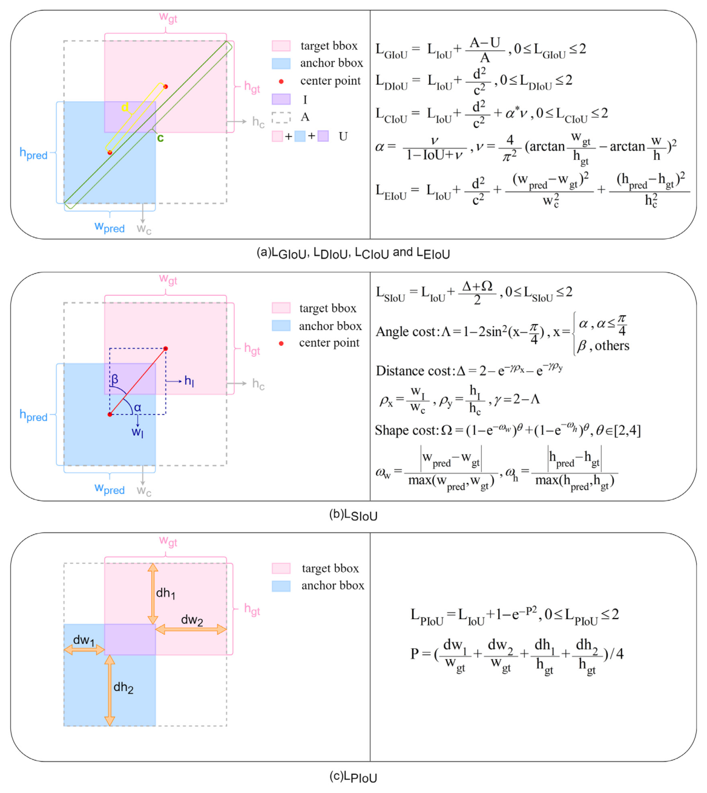

从图 (a)、(b) 可以看出，GIoU、DIoU、CIoU、EIoU 与 SIoU 的损失因子都用最小外接框（灰色虚线框）的对角线长度、宽高或面积作分母，而图 (c) 中的 PIoU 只用目标框的边长作分母。分母的这一差异正是锚框膨胀问题的根源，下面逐个拆解。

### 锚框膨胀的根源分析

膨胀现象可以从三类代表性惩罚项的梯度中找到共同根源。GIoU 的惩罚项为 $R_{GIoU}=(A-U)/A$，其中 $A$ 是最小外接框的面积，$U$ 是并集面积，其对 $A$ 与 $U$ 的梯度为：

$$\frac{\partial R_{GIoU}}{\partial A}=\frac{U}{A^2},\qquad \frac{\partial R_{GIoU}}{\partial U}=-\frac{1}{A}$$

由这两式可以推出 $\left|\partial R_{GIoU}/\partial U\right|\cdot U/A=\left|\partial R_{GIoU}/\partial A\right|$；当两框不重叠时 $U<A$，于是 $\left|\partial R_{GIoU}/\partial U\right|>\left|\partial R_{GIoU}/\partial A\right|$。这意味着当 $A$ 与 $U$ 增大相同数值时，$U$ 的变化对 $R_{GIoU}$ 的影响更大，二者同时增大反而使 $R_{GIoU}$ 下降。直观上，预测框不向目标框移动、仅靠「自我膨胀」就能减小 GIoU 惩罚，这与回归目标背道而驰。CIoU 与 EIoU 的距离惩罚项 $R_D=d^2/c^2$ 以最小外接框对角线长度 $c$ 为分母，$\partial R_D/\partial d=2d/c^2$ 表明 $c$ 增大时 $R_D$ 减小，因此在两框不重叠、$L_{IoU}$ 不变的情况下，单纯放大预测框就能降低损失。SIoU 的距离代价 $\Delta$ 对最小外接框宽度 $w_c$ 的梯度 $\partial\Delta/\partial w_c=-e^{-\gamma w_I}\cdot\gamma w_I/w_c^2$ 同样为负，$w_c$ 与 $h_c$ 增大时 $\Delta$ 下降，膨胀问题依然存在。三类惩罚项的分母都依赖最小外接框的尺寸，这就是锚框膨胀的共同根源。

不同损失引导的回归过程对比如下图所示。

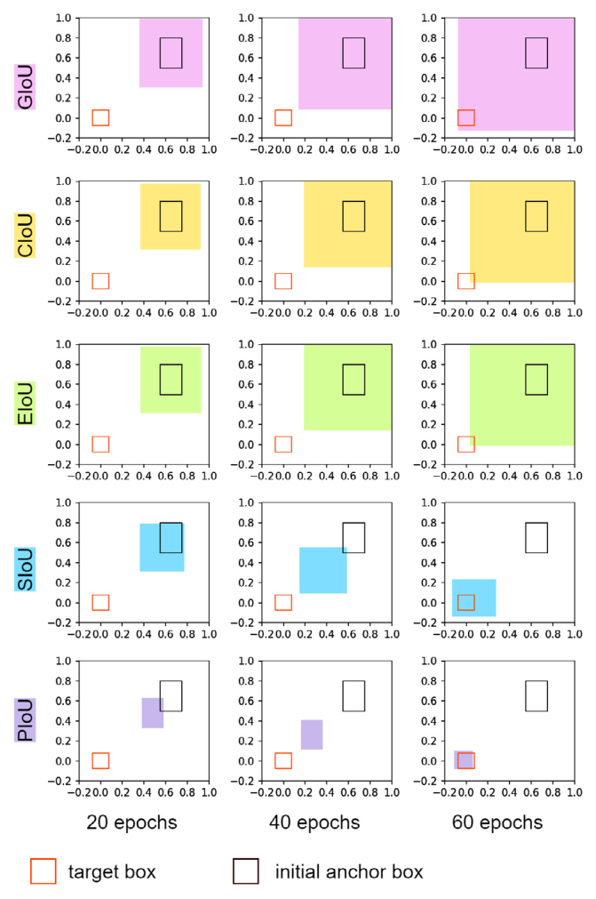

GIoU、CIoU、EIoU、SIoU 引导的锚框在回归初期都明显增大了面积，而 PIoU 引导的锚框几乎沿直线路径逼近目标框，在 60 epochs 时就对齐了目标。下图进一步给出一个静止锚框被放大后的数值反例。

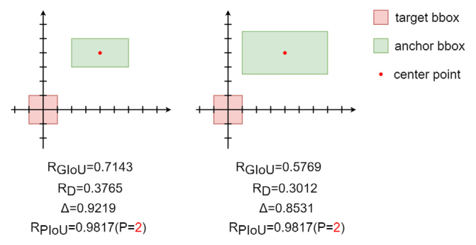

锚框面积增大后，$R_{GIoU}$ 从 0.7143 降到 0.5769，$R_D$ 从 0.3765 降到 0.3012，$\Delta$ 从 0.9219 降到 0.8531，唯有 $R_{PIoU}$ 保持 0.9817 不变。可见只要换用一个与最小外接框无关的分母，膨胀即可避免，这就是下一小节惩罚因子 $P$ 的出发点。

### 尺寸自适应惩罚因子

PIoU 的第一个组件是只依赖目标框尺寸的惩罚因子，用于直接度量四条边的对齐程度，其定义为：

$$P=\left(\frac{d_{w_1}}{w_{gt}}+\frac{d_{w_2}}{w_{gt}}+\frac{d_{h_1}}{h_{gt}}+\frac{d_{h_2}}{h_{gt}}\right)/4$$

其中 $d_{w_1}$、$d_{w_2}$、$d_{h_1}$、$d_{h_2}$ 是预测框与目标框对应两条宽边、两条高边之间距离的绝对值，$w_{gt}$ 与 $h_{gt}$ 分别是目标框的宽与高，几何示意见图 (c)。由于分母只取决于目标框的大小，锚框膨胀不会改变 $P$；只要预测框与目标框不完全重合，$P$ 就不会退化为 0；同时逐边除以目标框边长的写法使 $P$ 对目标尺寸具有自适应性。$P$ 解决的是「用什么来度量差距」，而惩罚项的梯度该多大，由下一小节的惩罚函数决定。

### 质量自适应惩罚函数与 PIoU 损失

惩罚函数 $f(x)$ 是 PIoU 的第二个组件，用于按锚框质量自适应地调节梯度幅值，其定义为：

$$f(x)=1-e^{-x^2}$$

$$PIoU=IoU-f(P),\quad -1\le PIoU\le 1$$

$$L_{PIoU}=1-PIoU=L_{IoU}+f(P),\quad 0\le L_{PIoU}\le 2$$

其中 $x$ 取惩罚因子 $P$ 的值，锚框质量越高 $P$ 越小。这等价于在 IoU 损失上叠加一个有界的非单调惩罚项。不同质量的锚框对应的损失与梯度如下图所示。

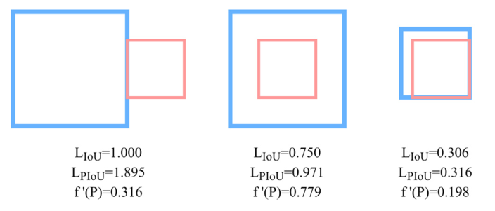

当 $P$ 很大（超过 2）时锚框质量极差，$f'(P)$ 取小值以抑制低质量锚框的有害梯度；当 $P$ 在 1 附近时锚框质量中等，$f'(P)$ 达到峰值以加速回归；当 $P$ 趋近 0 时梯度逐渐减小，锚框得以稳定地优化到与目标框完全对齐。给出一个简单的例子，假设某锚框与目标框的 $L_{IoU}=0.750$、边缘距离均值 $P=0.5$：先算 $f(0.5)=1-e^{-0.25}\approx 0.221$，于是 $L_{PIoU}=0.750+0.221=0.971$；再算梯度 $f'(P)=2Pe^{-P^2}\approx 0.779$，正处于峰值附近。可以看到，中等质量锚框同时获得了可观的惩罚量与接近最大的梯度，被优先推向目标框，这组数值与上图的中间案例一致。为了说明函数形式本身的重要性，原文用同一惩罚因子配了另外两个函数做对照：

$$g_1(x)=\frac{x^2}{2},\quad L_1=L_{IoU}+g_1(P)$$

$$g_2(x)=0.5x,\quad L_2=L_{IoU}+g_2(P)$$

三个函数及其导数的图像如下图所示。

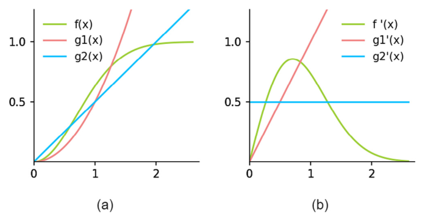

$g_1(x)$ 的梯度随锚框质量变差而增大，会把低质量锚框的有害梯度放大；$g_2(x)$ 的梯度恒定，对锚框质量毫无注意力；只有 $f(x)$ 呈现「两端小、中间大」的非单调形态，无需任何额外权重就实现了按质量的静态聚焦。函数形式的选择是否影响最终精度，实验节将用消融给出答案。

### 非单调聚焦机制与 PIoU v2

PIoU v2 是在 PIoU 上叠加显式注意力层后得到的强化版本，目标是增强对中等质量锚框的聚焦能力。此前的 Focal-EIoU 以 $L_{Focal\text{-}EIoU}=IoU^{\tau}L_{EIoU}$ 的形式引入回归版 Focal Loss，但注意力函数 $IoU^{\tau}$ 单调递增，只放大高质量锚框的梯度；WIoU 用 batch 内的平均质量做基准实现了动态非单调聚焦，却需要 $\delta$ 与 $\varepsilon$ 两个难以调定的超参数。PIoU v2 先把惩罚因子转换成质量度量：

$$q=e^{-P},\quad q\in(0,1]$$

其中 $q$ 度量锚框质量，$q=1$ 即 $P=0$，表示预测框与目标框完全重合，$P$ 越大 $q$ 越小、锚框质量越低。注意力函数及其作用方式定义为：

$$u(x)=3xe^{-x^2}$$

$$L_{PIoU\_v2}=u(\lambda q)\cdot L_{PIoU}=3\cdot(\lambda q)\cdot e^{-(\lambda q)^2}\cdot L_{PIoU}$$

其中 $\lambda$ 是控制注意力函数行为的唯一超参数。注意力层把最大梯度分配给中等质量的锚框，抑制低质量锚框的有害梯度，同时只引入一个需要调节的超参数，简化了调参过程。$u(\lambda x)$ 随 $\lambda$ 变化的形态如下图所示。

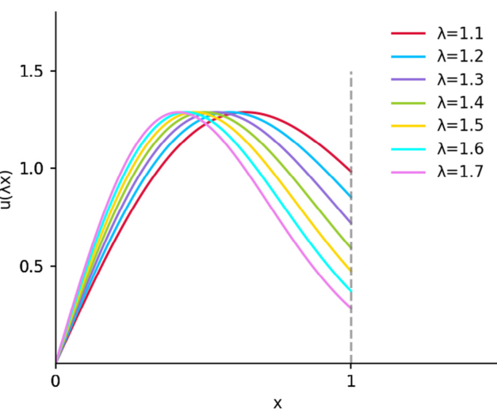

$\lambda$ 决定了梯度峰值对应的锚框质量位置：$\lambda$ 越大，峰值越偏向低质量一侧。$\lambda$ 该取多少，以及这一设计相对 $g_1$、$g_2$ 的优势，下面用实验来验证。

## 实验结果

### 实验设置

对比实验使用 MS COCO 与 PASCAL VOC 数据集；消融实验从 MS COCO 中选取 20 类，含 28,474 张训练图像与 1,219 张验证图像；泛化实验使用自建的 IC SEM 数据集，来自 55 nm 集成电路芯片的 SEM 图像，含 80 张训练图像（2,457 个实例）与 40 张验证图像（1,332 个实例），类别为 MCC、MOSFET 与 Filler。模型选用 YOLOv8-m（NVIDIA 3090 训练）与 DINO-4scale（V100 训练），除损失函数与 batch size 外其余设置均保持源码默认；未特别说明时 $\lambda=1.3$，评价指标为验证集上的 AP75、AP 与 AP50。

### 回归仿真对比

在正式检测实验之前，原文按 CIoU 的做法做了多框回归仿真：在位置 (1, 1) 处生成 7 种尺度、7 种长宽比的目标框与锚框，在半径 0.5 的圆形区域内均匀采样 5,000 个锚框起点，共 1,715,000 个回归案例，学习率 0.01、Adam 优化器、120 epochs，以 $L_{IoU}$ 为评价指标，结果如下图所示。

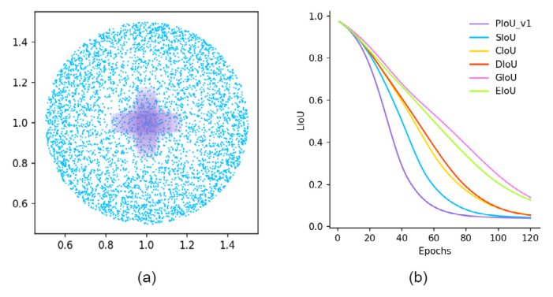

PIoU 的曲线下降最快，可见其收敛速度在六种损失中最快。其余 IoU 系损失在真实检测训练中通常至少需要 80-300 epochs 才能收敛，而 PIoU 只需 60 epochs 即可实现锚框与目标框的对齐，证明了惩罚因子与函数形式联合设计的有效性。

### 主流损失函数的定量对比

各损失函数搭配 YOLOv8-m 在 MS COCO 上的对比如下表所示。

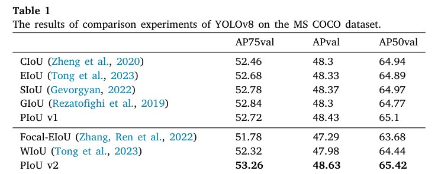

在 GIoU、CIoU、SIoU、EIoU、PIoU v1 五个基础版本中，PIoU v1 以 48.43 的 AP 最优；PIoU v2 进一步取得 53.26/48.63/65.42 的 AP75/AP/AP50，在全部损失函数中达到 SOTA，可见 0.5% AP75、0.5% AP50、0.3% AP 的提升幅度明显高于其他损失之间的差距。Focal-EIoU 相比 EIoU 反而全面下降，说明其注意力函数缺乏泛化性。DINO-4scale 搭配各聚焦机制损失在 VOC 上的结果如下表所示。

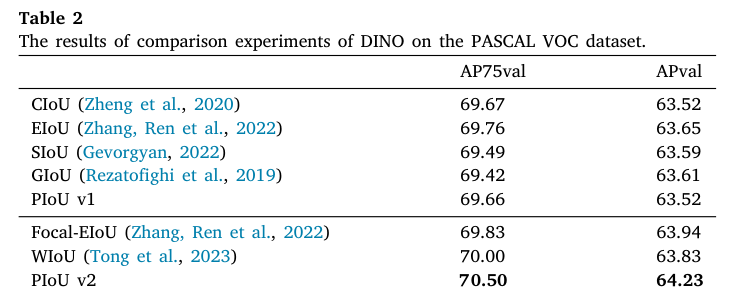

PIoU v2 以 70.50/64.23 的 AP75/AP 在全部损失函数中取得 SOTA，相比 DINO 原始的 GIoU 损失提升了 1.1% AP75 与 0.6% AP。在更贴近实际应用的 IC SEM 数据集上的结果如下表所示。

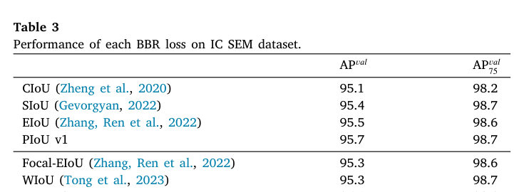

PIoU v2 以 96.0/98.9 的 AP/AP75 保持最高，而 Focal-EIoU 在此再度低于 EIoU，可见 PIoU v2 相对 PIoU v1 的增强在不同数据集上更加稳定。

### 检测结果可视化

为了直观展示性能提升，原文在 COCO2017-val 的若干图像上对比了不同损失训练出的模型的预测结果，部分样例如下图所示。

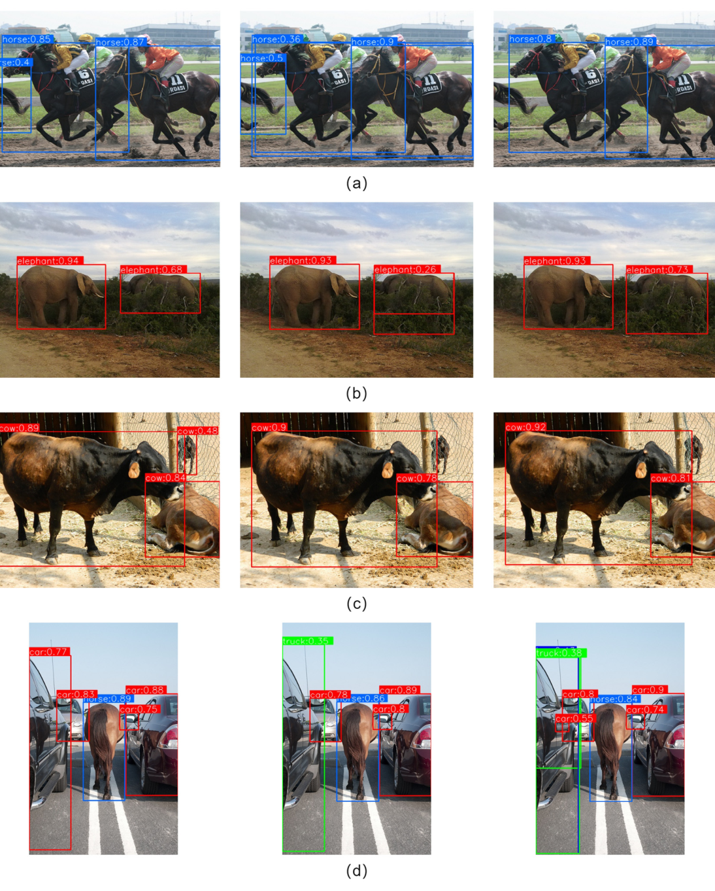

使用 PIoU v2 的模型对不完整目标更敏感，能够凭部分区域准确判断类别并定位，例如 (b) 中只露出后半身的 elephants 与 (d) 中被车辆遮挡的 horse；使用 Focal-EIoU 与 WIoU 的模型则漏掉了不完整目标，或出现定位与分类错误，可见 PIoU v2 的聚焦机制确实改善了对中低质量目标的回归质量。

### 超参数敏感性消融

$\lambda$ 从 1.1 扫到 1.7 的结果如下表所示。

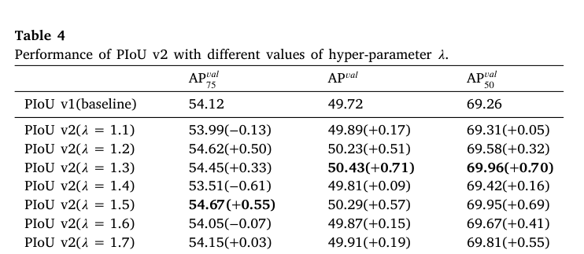

$\lambda=1.3$ 时模型取得最佳的 50.43(+0.71) AP 与 69.96(+0.70) AP50；$\lambda$ 偏大或偏小时，高质量样本的梯度增益与梯度峰值对应的 $P$ 都不再适合收敛，部分档位的 AP75 甚至低于基线，表明 PIoU v2 对 $\lambda$ 较为敏感、1.3 附近是最优工作区。

### 惩罚函数形式消融

同一惩罚因子搭配三种函数形式的对比如下表所示。

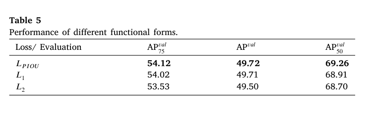

$f(x)$ 在 54.12/49.72/69.26 的三项指标上全面优于 $g_1(x)$ 与 $g_2(x)$，可见「两端小、中间大」的梯度形态确实比单调递增或恒定的梯度更适合锚框回归，验证了方法节对函数形态的设计动机；原文也指出，若初始锚框普遍质量极差，可能存在与 $P$ 搭配更佳的函数形式，这留待后续研究。

## 优点和创新点

个人认为，本文有如下一些优点和创新点可供参考学习：

1. 对锚框膨胀现象给出了根因级分析，用梯度推导证明四类代表性损失的惩罚因子都以最小外接框尺寸为分母，再以数值反例与百万例回归仿真双重验证，思路可迁移到新损失的设计中。
2. 惩罚因子 $P$ 只用目标框边长作分母，天然免疫锚框膨胀且自适应目标尺寸，配合 $f(x)$ 无需额外权重即实现按锚框质量的梯度调节，设计巧妙。
3. PIoU v2 的非单调注意力层只有一个超参数，调参成本低于 WIoU 的双超参数设计，并在 YOLOv8 与 DINO 及三个数据集上取得一致提升，说服力强。
