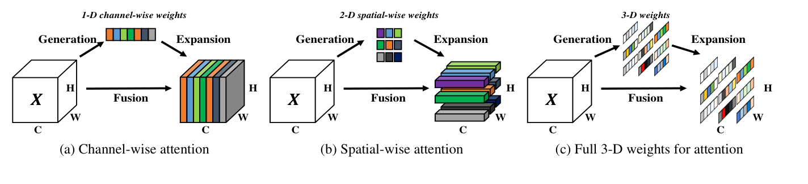
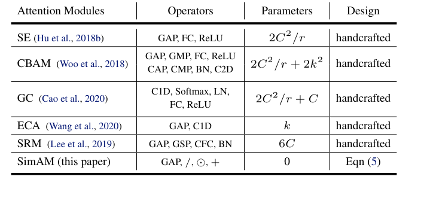
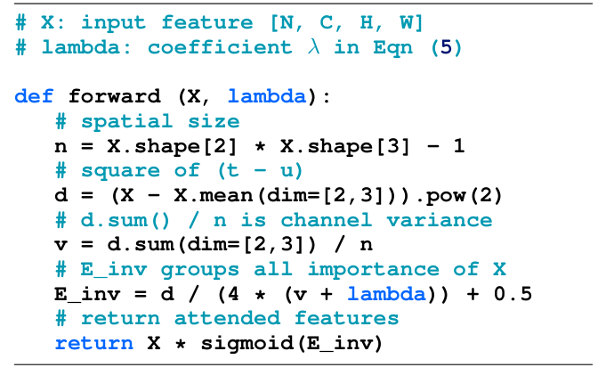
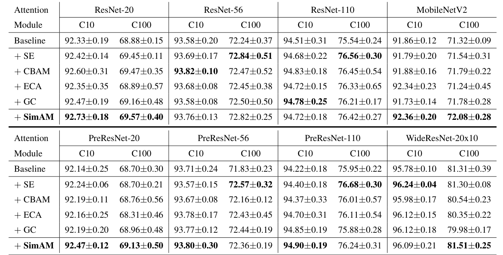
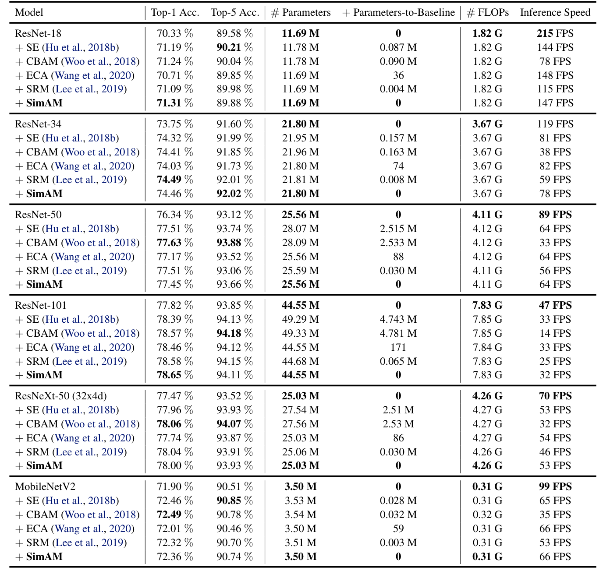
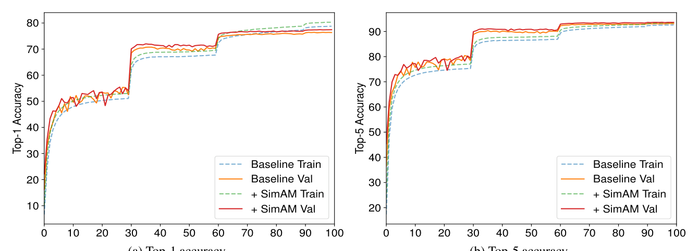
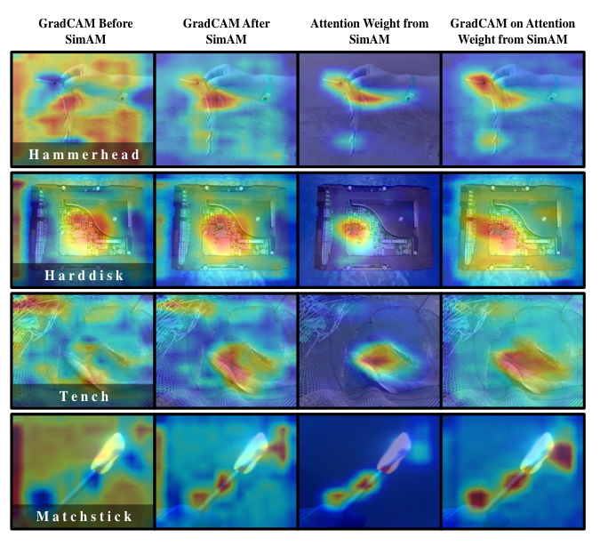
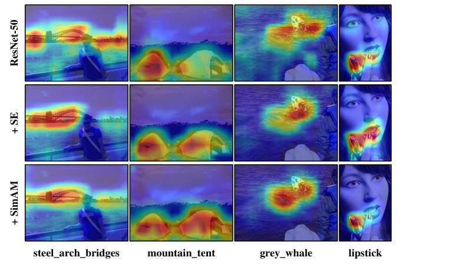
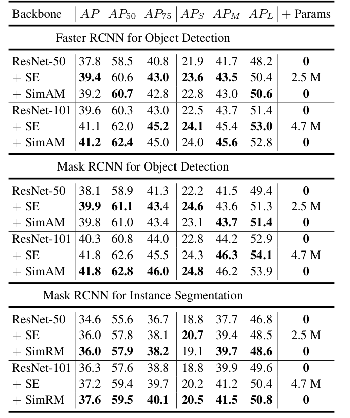

# SimAM: A Simple, Parameter-Free Attention Module for Convolutional Neural Networks

Paper Reading 是从个人角度进行的一些总结分享，受到个人关注点的侧重和实力所限，可能有理解不到位的地方。具体的细节还需要以原文的内容为准，博客中的图表若未另外说明则均来自原文。

| 论文概况 | 详细 |
| --- | --- |
| 标题 | 《SimAM: A Simple, Parameter-Free Attention Module for Convolutional Neural Networks》 |
| 作者 | Lingxiao Yang, Ru-Yuan Zhang, Lida Li, Xiaohua Xie |
| 发表会议 | ICML 2021（Proceedings of the 38th International Conference on Machine Learning, PMLR 139） |
| 会议等级 | CCF-A |
| 发表年份 | 2021 |
| 论文代码 | [Pytorch-SimAM](https://github.com/ZjjConan/SimAM) |

作者单位：

1. 中山大学计算机科学与工程学院
2. 广东省信息安全技术重点实验室（中山大学）
3. 机器智能与先进计算教育部重点实验室（中山大学）
4. 上海交通大学心理与行为科学研究院
5. 上海市精神疾病重点实验室、上海市精神卫生中心（上海交通大学）
6. 香港理工大学

## 研究动机

图像分类、目标检测等视觉任务的性能在很大程度上取决于卷积神经网络（ConvNet）的表征能力，而构建强大的 ConvNet 一直是视觉研究的一项基础任务。现代 ConvNet 通常由多个阶段组成，每个阶段又包含若干由卷积、池化、激活等算子构成的 block，围绕 block 的改进由此形成了两条主要路线：一条直接设计更先进的 block 结构，代表工作包括堆叠卷积、残差单元与密集连接；另一条构建即插即用的注意力模块，在 block 内部精炼卷积输出，代表工作 SE（Squeeze-and-Excitation）能够捕获任务相关特征并抑制背景激活，并已被插入 VGG、ResNets、ResNeXts 等多种架构，甚至进入 AutoML 流程参与网络结构搜索。

然而，现有注意力模块存在两方面局限。一方面，它们只能沿通道或空间单个维度精炼特征，生成的 1-D 或 2-D 权重会把同一通道或同一空间位置内的所有神经元同等对待，限制了网络学习跨通道与空间联合变化的判别性权重，例如 SE 在灰鲸图像上会丢失部分主体区域；另一方面，注意力权重的生成方法大多建立在缺乏统一依据的启发式结构之上，模块性能取决于池化方式、全连接层等算子的组合选择，需要大量工程努力与结构调优。暂未有工作从统一的神经计算原理出发，同时解决 3-D 权重推断与免手工结构设计这两个瓶颈。

## 文章贡献

针对现有注意力模块只能生成低维权重且依赖手工结构设计的局限，本文提出了 SimAM，一个概念简单且完全无参的注意力模块。其核心是借鉴哺乳动物大脑中的空间抑制理论，把「评估单个神经元的重要性」形式化为一个能量函数的最小化问题——能量越低的神经元与周围神经元的区分度越大，对视觉处理越重要。首先，本文为特征图中的每个神经元定义能量函数，以目标神经元与其所在通道内其余神经元的线性可分性来度量神经元的重要性；接着，推导出该能量函数关于权重与偏置的闭式解，避免了代价高昂的迭代求解，使模块能以极低的计算开销直接得到全部神经元的重要性；最终，整个模块以不到十行的代码实现，以零参数的方式插入现有网络，并对特征施加全 3-D 加权精炼。实验表明，SimAM 在图像分类、目标检测与实例分割等多种任务上，以不增加任何参数的代价，取得了与其他流行注意力模块相当甚至更优的精度、模型规模与速度表现。

## 本文方法

本文方法沿「分析现有模块的权重形态 → 定义能量函数 → 推导闭式解 → 特征精炼与实现」的流程展开，以下按此顺序介绍。

### 从 1-D、2-D 权重到全 3-D 权重

现有注意力模块的权重生成流程是本节的分析对象，本文据此引出全 3-D 权重的设计动机。三类模块的注意力计算步骤对比如下图所示。

如图所示，通道注意力（a）先从特征 $X$ 生成 1-D 通道权重再扩展融合，空间注意力（b）生成 2-D 空间权重，而本文的 SimAM（c）直接为 $C \times W \times H$ 的特征估计全 3-D 权重。这两类既有机制分别对应人脑中基于特征的注意力与基于空间的注意力，但在人类视觉处理中两者共存并共同完成信息选择，因此本文让每个神经元都获得独立的权重。与之配套，下表对比了各模块的结构设计与参数量。

可以看出，SE、CBAM、GC、ECA、SRM 等模块均由大量人工选择的算子（FC、C2D、BN 等）组合而成并带有可学习参数，而 SimAM 仅使用全局平均池化、除法、逐元素乘法与加法，参数量为 0，其结构完全由后文式 (5) 的解推导而来。这一对比界定了本文模块的输出形态与设计原则，接下来介绍能量函数的定义。

### 基于空间抑制理论的能量函数

能量函数是把神经科学理论转化为可计算模块的关键步骤。在视觉神经科学中，信息量最大的神经元通常是放电模式与周围神经元显著不同的神经元，而且活跃神经元还会抑制周围神经元的活动，这一现象被称为空间抑制（spatial suppression）；展现明显空间抑制效应的神经元，应当在视觉处理中被赋予更高的重要性。度量这种重要性的最直接实现，是计算目标神经元与其他神经元之间的线性可分性。考虑输入特征 $X \in \mathbb{R}^{C \times H \times W}$ 单个通道内的目标神经元 $t$ 与其余神经元，本文为其定义如下能量函数：

$$e_t(w_t, b_t, y, x_i) = (y_t - \hat{t})^2 + \frac{1}{M-1}\sum_{i=1}^{M-1}(y_o - \hat{x}_i)^2$$

其中 $t$ 与 $x_i$ 分别是目标神经元和同一通道内的其他神经元，$i$ 遍历空间维度，$M = H \times W$ 是该通道的神经元总数；$\hat{t} = w_t t + b_t$ 与 $\hat{x}_i = w_t x_i + b_t$ 是二者的线性变换，$w_t$、$b_t$ 为变换的权重与偏置；$y_t$ 与 $y_o$ 是两个不同的标签。该式在 $\hat{t}$ 等于 $y_t$ 且全部 $\hat{x}_i$ 等于 $y_o$ 时取得最小值，因此最小化它等价于寻找目标神经元与同通道其余神经元之间的线性可分性。为简化形式，本文对 $y_t$、$y_o$ 取二值标签 $1$ 和 $-1$，并加入正则项，最终能量函数为：

$$e_t(w_t, b_t, y, x_i) = \frac{1}{M-1}\sum_{i=1}^{M-1}(-1 - (w_t x_i + b_t))^2 + (1 - (w_t t + b_t))^2 + \lambda w_t^2$$

其中 $\lambda$ 是正则系数。这一能量函数为每个神经元都建立了一个独立方程，其求解方式由下一小节的闭式解给出。

### 能量函数的闭式解

闭式解的目标是避免对通道内 $M$ 个能量函数逐一执行迭代求解。理论上每个通道有 $M$ 个能量函数，用 SGD 等迭代求解器计算代价过高，而式 (2) 关于 $w_t$ 和 $b_t$ 存在快速的闭式解：

$$w_t = -\frac{2(t - \mu_t)}{(t - \mu_t)^2 + 2\sigma_t^2 + 2\lambda}, \quad b_t = -\frac{1}{2}(t + \mu_t)w_t$$

其中 $\mu_t = \frac{1}{M-1}\sum_{i=1}^{M-1} x_i$ 与 $\sigma_t^2 = \frac{1}{M-1}\sum_{i=1}^{M-1}(x_i - \mu_t)^2$ 是该通道内除 $t$ 之外所有神经元计算的均值与方差。由于式 (3)、式 (4) 的解建立在单个通道上，本文进一步假设同通道内所有像素服从同一分布，于是均值与方差可以在整个通道上计算一次并供所有神经元复用，从而把最小能量压缩为：

$$e_t^* = \frac{4(\hat{\sigma}^2 + \lambda)}{(t - \hat{\mu})^2 + 2\hat{\sigma}^2 + 2\lambda}$$

其中 $\hat{\mu} = \frac{1}{M}\sum_{i=1}^{M} x_i$ 与 $\hat{\sigma}^2 = \frac{1}{M}\sum_{i=1}^{M}(x_i - \hat{\mu})^2$ 是基于全部 $M$ 个神经元计算的均值与方差。式 (5) 表明能量 $e_t^*$ 越低，神经元 $t$ 与周围神经元的区分度越大、对视觉处理越重要，因此神经元的重要性可以直接取 $1/e_t^*$。

给出一个简单的例子，假设某通道是 $2 \times 2$ 的特征图，4 个神经元的取值为 $[3, 1, 1, 1]$，正则系数取 CIFAR 实验采用的 $\lambda = 10^{-4}$。全通道统计为 $\hat{\mu} = 1.5$、$\hat{\sigma}^2 = 0.75$，代入式 (5)：目标神经元 $t = 3$ 的能量为 $e^* = 4(0.75 + 0.0001) / ((3-1.5)^2 + 2 \times 0.75 + 2 \times 0.0001) \approx 0.80$，而取值为 $1$ 的神经元能量约为 $1.71$。可以看到，与周围差异大的神经元能量更低、重要性 $1/e^*$ 更高，这正是空间抑制理论的量化体现。这一小节的闭式解把逐神经元求解压缩为逐通道统计，是模块无需参数与训练的直接原因，其输出接下来将用于特征精炼。

### 特征精炼与轻量实现

特征精炼阶段把神经元重要性转化为对原始特征的加权输出。根据神经生理学证据，哺乳动物大脑中的注意力调制通常表现为神经元响应上的增益（缩放）效应，因此本文采用缩放算子而非加法来完成精炼：

$$\tilde{X} = \text{sigmoid}(1/E) \odot X$$

其中 $E$ 把所有神经元的 $e_t^*$ 沿通道与空间维度聚合而成，$\odot$ 表示逐元素乘法；sigmoid 用于限制 $E$ 中过大的数值，且作为单调函数不会改变神经元之间的相对重要性。整个模块的 Pytorch 风格实现如下图所示。

概括起来就是：先计算特征与通道均值的差平方 $d$，再由 $d$ 得到通道方差 $v$，随后按式 (6) 组合出全部神经元的重要性 $E_{inv}$，最后经 sigmoid 加权回乘到原特征。除通道均值与方差外，模块内全部是逐元素运算，因此能充分利用现有深度学习库；在使用时，本文把该模块插入每个 block 内第二个卷积层之后。至此数据流闭合：输入特征经通道统计产生 3-D 重要性，再经 sigmoid 缩放回原特征，全程不引入任何可学习参数。

## 实验结果

实验覆盖 CIFAR 与 ImageNet 图像分类、COCO 目标检测与实例分割三类任务。为保证公平对比，本文使用 PyTorch 在一致设置下重新实现了全部对比方法。

### CIFAR 图像分类

CIFAR 实验验证 SimAM 在小数据集与多种架构上的有效性。本文把模块插入 ResNet-20/56/110、PreResNet-20/56/110、WideResNet-20x10 与 MobileNetV2，与 SE、CBAM、ECA、GC 四个模块对比，每组实验报告 5 次运行的均值与标准差，结果如下表所示。

可以看出，SimAM 在全部基线网络上都带来一致提升，在 ResNet-20 与 PreResNet-20 等小网络上精度领先所有对比模块，在 WideResNet-20x10 的 CIFAR-100 上以 81.51% 的精度位列第一，说明零参数模块的有效性不依赖于特定网络结构。模块唯一的超参数 $\lambda$ 通过交叉验证搜索确定，结果如下图所示。

该搜索在 CIFAR-100 训练集的 45k/5k 划分上进行，$\lambda$ 池取 $10^{-1}$ 到 $10^{-6}$，每个取值重复 5 次。可见宽范围 $\lambda$ 内模块均显著优于基线，且 $\lambda = 10^{-4}$ 在精度与标准差之间取得良好平衡，因此 CIFAR 实验统一采用该取值。

### ImageNet 图像分类

ImageNet 实验进一步验证模块在大规模数据上的表现。实验使用约 1.2 M 训练图像与 50 k 验证图像，backbone 覆盖 ResNet-18/34/50/101、ResNeXt-50 与 MobileNetV2，对比 SE、CBAM、ECA、SRM 四个模块（GC 因训练管线差异较大未纳入），$\lambda$ 按半分辨率 ResNet-18 的搜索结果取 0.1，各模型的精度、参数量与推理速度如下表所示。

可见 SimAM 在 ResNet-18 上以 71.31% 的 Top-1 精度领先全部对比模块，在 ResNet-101 上取得 78.65% 的最优结果，同时不增加任何参数；推理速度与 SE、ECA 处于同一水平（ResNet-18 上 147 FPS，而 CBAM 仅 78 FPS），表明模块在精度与效率之间取得了良好权衡。ResNet-50 的训练与验证曲线如下图所示。

图中 +SimAM 的训练曲线与验证曲线都整体高于基线，说明模块对表征能力的提升贯穿训练全过程而非仅影响最终收敛点。

### 可视化分析

可视化实验直观展示 3-D 权重对特征的精炼效果。本文用 Grad-CAM 对比插入 SimAM 前后的特征激活，结果如下图所示。

图中每列从左到右依次是精化前特征的 Grad-CAM、精化后特征的 Grad-CAM、SimAM 注意力权重以及对注意力权重的 Grad-CAM。可以看出，精化后的特征更聚焦于主目标，且 Grad-CAM 热图与 SimAM 掩码高度一致，验证了 3-D 权重确实按神经元重要性选择判别性区域。开篇的下图从网络层面给出了同样的结论。

图中 ResNet-50 插入 SimAM 后，热力图聚焦的区域与图像标签更加吻合（如 mountain_tent 与 grey_whale），说明模块帮助网络抓住了与任务相关的主要线索。

### COCO 目标检测与实例分割

迁移实验检验 SimAM 对下游任务的增益。本文以 Faster R-CNN 与 Mask R-CNN（均搭配 FPN）为检测器，骨干网络在 ImageNet-1K 预训练后在 COCO 2017 上微调，全部模型经 mmdetection 在一致设置下训练，仅与 SE 及基线对比，结果如下表所示。

可见两个注意力模块都能大幅提升基线性能：目标检测上二者精度非常接近（Faster R-CNN 配 ResNet-101 时 SimAM 41.2 对 SE 41.1），实例分割上 SimAM 以 37.6% 略优于 SE 的 37.2%；而 SE-ResNet-50/101 需要额外引入 2.5 M 与 4.7 M 参数，SimAM 始终保持零参数，验证了其作为轻量即插即用模块在多种视觉任务上的普适性。

## 优点和创新点

个人认为，本文有如下一些优点和创新点可供参考学习：

1. 以神经科学的统一原理取代手工设计：从空间抑制理论出发，把注意力权重生成形式化为能量函数最小化并推导闭式解，让通道与空间注意力在全 3-D 权重下自然统一，无需手工结构调优。
2. 完全无参且保持高效：闭式解让模块在 ImageNet 上零参数超越基线（ResNet-18 Top-1 71.31%），推理速度与 SE、ECA 相当，精度-效率权衡极具吸引力。
3. 实验丰富、说服力强：覆盖 CIFAR 8 种架构、ImageNet 6 种模型与 COCO 检测、分割任务，从精度、参数、速度三个维度对比，并辅以 Grad-CAM 可视化支撑。
