# YOLO-Master: MOE-Accelerated with Specialized Transformers for Enhanced Real-time Detection

Paper Reading 是从个人角度进行的一些总结分享，受到个人关注点的侧重和实力所限，可能有理解不到位的地方。具体的细节还需要以原文的内容为准，博客中的图表若未另外说明则均来自原文。

| 论文概况 | 详细 |
| --- | --- |
| 标题 | 《YOLO-Master: MOE-Accelerated with Specialized Transformers for Enhanced Real-time Detection》 |
| 作者 | Xu Lin、Jinlong Peng、Zhenye Gan、Jiawen Zhu、Jun Liu |
| 发表会议 | 未获取（arXiv 预印本，编号 arXiv:2512.23273） |
| 会议等级 | 未获取 |
| 发表年份 | 2025 |
| 论文代码 | github.com/isLinXu/YOLO-Master |

作者单位：

1. Tencent Youtu Lab（腾讯优图实验室）
2. Singapore Management University（新加坡管理大学）

## 研究动机

实时目标检测是自动驾驶、视频监控与机器人系统中的关键任务，要求模型在有限算力下同时给出准确的检测精度与实时的推理速度，YOLO 系列凭借单阶段框架在其中长期占据主导地位。但是，现有 YOLO 架构无一例外地采用静态密集计算：无论输入是稀疏大目标的简单场景，还是密集小目标的复杂场景，所有特征都流经完全相同的网络通路、消耗统一的计算资源，导致简单场景上的计算冗余与复杂场景上的表征容量不足并存，检测性能与计算效率同时受损。从 YOLOv1 到最新迭代，每一代改进都集中在骨干结构、多尺度融合与训练策略的静态设计上，计算预算与网络容量在设计阶段即被固定，缺乏依据输入特性动态分配资源的机制；针对复杂城市场景优化的检测器在简单高速路上过参数化，为效率调优的检测器又在困难场景下容量不足。大语言模型领域的研究揭示了稀疏激活的价值——不同输入选择性地激活不同的参数子集，可以同时改善效率与适应性，而这一条件计算范式尚未在轻量级 CNN 实时检测器上得到系统验证。暂未有工作把混合专家框架引入实时目标检测，依据场景复杂度自适应地分配计算资源。

## 文章贡献

针对静态密集计算造成的资源错配问题，本文提出了 YOLO-Master，一个在 YOLO 流水线内引入混合专家（MoE）框架的实时目标检测架构。其核心是高效稀疏混合专家模块 ES-MoE，通过动态路由网络按输入内容的场景复杂度选择性地激活专家子集。首先，本文把 ES-MoE 插入骨干与颈部，用深度可分离卷积构建具有不同感受野的多尺度专家，训练阶段采用软 Top-K 路由保持梯度流动，推理阶段切换为硬 Top-K 实现真实的计算稀疏；接着，本文设计面向检测任务的负载均衡监督，以专家平均利用率与均匀分布之间的均方误差抑制专家坍缩；最终，模型在推理时仅调用 $K$ 个专家完成前向传播，把计算资源集中到困难输入上。实验表明，YOLO-Master 在 MS COCO、PASCAL VOC、VisDrone、KITTI 与 SKU-110K 五个基准上全部取得领先，在 MS COCO 上以 1.62 ms 延迟达到 42.4% AP，超过 YOLOv13-N 0.8% mAP 且推理快 17.8%，验证了自适应容量分配能够突破静态精度-效率权衡。

## 本文方法

本文方法在保留标准 YOLO 三段式布局的同时，把稀疏条件计算封装为可即插即用的 ES-MoE 模块，整体结构按模块划分为总体架构、专家网络、门控网络、软 Top-K 训练路由、硬 Top-K 推理路由与损失函数六个部分，整体框架如下图所示。

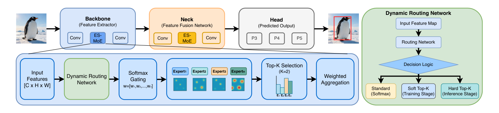

图中左上是插入 ES-MoE 后的 Backbone-Neck-Head 主干通路，左下是 ES-MoE 内部的信息流，右侧是动态路由网络在标准 Softmax、软 Top-K（训练）与硬 Top-K（推理）三种决策逻辑之间切换的机制。ES-MoE 由动态路由网络、Softmax 门控与加权聚合三个组件串联而成，下面依次展开。

### 总体架构与信息流

ES-MoE 的目标是把「同一通路处理所有输入」的静态计算替换为按实例条件激活的稀疏计算。给定输入特征图 $X \in \mathbb{R}^{C \times H \times W}$，模块先用动态路由网络提取路由特征，再由 Softmax 门控计算各专家的权重分布。设专家总数为 $E$，分配给第 $i$ 个专家的门控权重 $w_i$ 计算为：

$$w_i = \frac{\exp(g_i(X))}{\sum_{j=1}^{E} \exp(g_j(X))}, \quad i = 1, 2, \ldots, E$$

其中 $g_i(\cdot)$ 是第 $i$ 个专家对应的门控函数。基于权重 $w$，模块选出得分最高的 top-$K$ 个专家（$K \ll E$ 以保证稀疏），把选中专家的输出经加权聚合成增强特征 $Y$：

$$Y = \mathrm{Norm}\left(\sum_{i \in T_K} w_i \cdot \mathrm{Expert}_i(X)\right)$$

| 符号 | 含义 |
| --- | --- |
| $X \in \mathbb{R}^{C \times H \times W}$ | 输入特征图，$C$、$H$、$W$ 分别为通道数、高与宽 |
| $E$ | 专家总数 |
| $g_i(\cdot)$ | 第 $i$ 个专家的门控函数 |
| $T_K$ | 权重最高的 top-$K$ 个专家的索引集合 |
| $\mathrm{Norm}(\cdot)$ | 稳定聚合特征的归一化操作 |

直观上，每个输入只为自己「点名」少数最匹配的专家，简单输入激活的路径短、复杂输入获得的容量大。该模块在骨干中负责跨尺度与场景复杂度的特征增强，在颈部中负责多尺度自适应融合，其输出直接送回主干通路参与后续卷积与融合。

### 专家网络设计

专家网络的组成目标是让 $E$ 个独立变换在保持轻量的同时覆盖不同的感受野。为满足实时检测的算力约束，每个专家以深度可分离卷积为基本构件，代替标准卷积：

$$\mathrm{Expert}_i(X) = \mathrm{DWconv}_{k_i, C_{in} \to C_{out}}(X)$$

其中 $\mathrm{DWconv}_{k_i, C_{in} \to C_{out}}$ 表示核大小为 $k_i$、通道从 $C_{in}$ 映射到 $C_{out}$ 的深度可分离卷积，它把空间滤波与通道信息整合解耦，大幅压缩参数量与 FLOPs。为了让不同专家擅长不同尺度的模式，$k_i$ 取互不相同的奇数（$3, 5, 7, \ldots$），使专家组覆盖从小到大一系列感受野。每个专家的输出 $Y_i$ 保持与输入相同的空间分辨率，全部专家输出按路由权重 $\Omega = [\omega_1, \ldots, \omega_E]$ 聚合：

$$Y_{MoE} = \sum_{i=1}^{E} \omega_i \cdot Y_i$$

其中 $Y_{MoE} \in \mathbb{R}^{C_{out} \times H \times W}$ 是 ES-MoE 的最终输出。这等价于用路由权重对一组多尺度滤波器做凸组合，专家网络因此能在单核卷积块无法兼顾的多个空间范围上自适应地聚合上下文。

### 门控网络设计

门控网络 $G$ 负责生成激活 $E$ 个专家的原始 logits $\Lambda \in \mathbb{R}^{E \times 1 \times 1}$，其设计前提是路由决策本身不能成为计算瓶颈。路由权重应来自全局上下文而非局部特征，才能为整张特征图提供统一指引，因此先用全局平均池化把输入压缩成紧凑描述子：

$$P = \mathrm{GAP}(X)$$

其中 $P \in \mathbb{R}^{C \times 1 \times 1}$ 是全局描述子。随后 $P$ 经过一个参数高效的门控网络，它由两层 $1 \times 1$ 卷积（$C_{in} \to C_{red} \to E$）与非线性激活构成，计算流程定义如下：

$$\Lambda = \mathrm{Conv}_{out=E}^{1 \times 1}\left(\mathrm{SiLU}\left(\mathrm{Conv}_{out=C_{red}}^{1 \times 1}(P)\right)\right)$$

其中 $\mathrm{Conv}_{out=C'}^{1 \times 1}$ 表示输出通道数为 $C'$ 的 $1 \times 1$ 卷积，中间通道数按缩减率 $\gamma = 8$ 设为 $C_{red} = \max(C/\gamma, 8)$。由于整条通路只作用于通道维，生成 logits 的计算量只依赖 $C$ 与 $E$、与空间尺寸 $H \times W$ 无关，门控因此在高分辨率的骨干与颈部特征图上都能高效运行。$\Lambda$ 随后交给分阶段路由策略完成专家选择。

### 软 Top-K 训练路由

训练阶段路由设计的追求是在强制稀疏的同时保持非零权重的梯度连续。门控输出的 logits 先经 Softmax 归一化得到初始权重：

$$\Omega' = \frac{\exp(\Lambda_i)}{\sum_{j=1}^{E} \exp(\Lambda_j)}$$

其中 $\Omega'$ 表示每个专家被选中的概率。接着找出 $\Omega'$ 中最大的 $K$ 个权重的索引集 $I_K$，构造二值硬掩码：

$$M_{K,i} = \begin{cases} 1 & \text{if } i \in I_K \\ 0 & \text{otherwise} \end{cases}$$

把 $\Omega'$ 与 $M_K$ 逐元素相乘并对非零项重归一化，得到训练期权重：

$$\Omega^{train} = \frac{\Omega' \odot M_K}{\sum_{j=1}^{E} (\Omega')_j \odot (M_K)_j + \epsilon}$$

其中 $\epsilon$ 是防止除零的极小值，$\odot$ 表示逐元素相乘。给出一个简单的例子，假设 $E = 4$、$K = 2$，某样本的 logits 为 $\Lambda = [2.1, 0.9, 0.3, -0.5]$，Softmax 后 $\Omega' \approx [0.65, 0.20, 0.11, 0.05]$；取 top-2 索引集 $I_K = \{1, 2\}$，掩码屏蔽后两项并重归一化，得到 $\Omega^{train} \approx [0.77, 0.23, 0, 0]$。可以看到，只有两个专家真正参与聚合，但被选中的权重仍由 $\Omega'$ 连续计算而来，梯度得以流回门控网络，路由因此在稀疏激活下依然可微、可学习。

### 硬 Top-K 推理路由与动态切换

推理阶段路由设计追求真实的计算稀疏化，不再为落选专家保留任何计算。本文直接从 $\Lambda$ 中选出最大的 $K$ 个 logits，只对它们做 Softmax 归一化，其余 $E - K$ 个专家的权重严格置零：

$$\Omega_{infer,i} = \begin{cases} \dfrac{\exp(\Lambda_i)}{\sum_{j \in I_K} \exp(\Lambda_j)} & \text{if } i \in I_K \\[2ex] 0 & \text{otherwise} \end{cases}$$

其中 $I_K$ 是按 logits 排序得到的 top-$K$ 索引集。该策略保证稀疏前向传播时只有 $K$ 个专家模块被真正调用，从而在实际硬件上获得确定性加速。两种模式依据训练状态开关自动切换：

$$\Omega = \begin{cases} \Omega^{train} & \text{if Training} \\ \Omega^{infer} & \text{if Inference} \end{cases}$$

直观上，训练期「软而稠密地学」，推理期「硬而稀疏地算」，切换发生在同一个前向逻辑内，不需要额外的模型改造。路由输出 $\Omega$ 交给上一节的加权聚合单元完成特征合成。

### 损失函数与负载均衡

损失设计的目标是在保证检测精度的同时解决 MoE 训练固有的专家利用失衡。总损失由标准 YOLOv8 检测损失与负载均衡损失两项构成，形式化为 $L_{Total} = L_{YOLO} + \lambda_{LB} \cdot L_{LB}$，其中 $\lambda_{LB} > 0$ 控制均衡项的贡献权重。检测损失沿用 YOLOv8 的三分量形式：

$$L_{YOLO} = L_{cls} + L_{loc} + L_{DFL}$$

其中 $L_{cls}$ 度量预测与真值类别的偏差，$L_{loc}$ 用 CIoU 或 DIoU 评估边界框的重叠与位置偏差，$L_{DFL}$ 优化边界框的分布表示。负载均衡损失针对专家坍缩现象——路由网络倾向把多数输入分给少数「更强」的专家——先定义专家 $i$ 在当前 batch 与全部空间位置上的平均利用率：

$$\mu_i = \mathbb{E}\left[\frac{\sum_{h=1}^{H} \sum_{w=1}^{W} (\Omega^{train})_{i,h,w}}{\sum_{j=1}^{E} \sum_{h=1}^{H} \sum_{w=1}^{W} (\Omega^{train})_{j,h,w}}\right]$$

其中 $(\Omega^{train})_{i,h,w}$ 是训练期软路由权重在位置 $(h, w)$ 上对专家 $i$ 的取值。$L_{LB}$ 采用均方误差度量 $\mu_i$ 与理想均匀利用率 $1/E$ 的偏差：

$$L_{LB} = \frac{1}{E} \sum_{i=1}^{E} \left(\mu_i - \frac{1}{E}\right)^2$$

最小化 $L_{LB}$ 等价于约束各专家在训练中被均匀使用，模型因此能充分利用全部 $E$ 个专家的容量。该损失只通过训练期软权重 $\Omega^{train}$ 反传，与推理期的硬稀疏互不干扰，使均衡约束不以牺牲部署稀疏性为代价。

## 实验结果

### 实验设置

实验覆盖五个差异明显的基准：MS COCO 2017（118k 图、80 类）、PASCAL VOC 2007+2012（16.5k 图、20 类）、VisDrone-2019（6.5k 图、10 类）、KITTI（7.5k 图、3 类）与 SKU-110K（8.2k 图、1 类）。基线为 YOLOv12-Nano（宽度缩放因子 0.50），所有模型在 $640 \times 640$ 分辨率下用 SGD 训练 600 epoch，总 batch size 为 256，数据增强含 Mosaic（$p=1.0$）、Copy-Paste（$p=0.1$），Nano 变体禁用 MixUp。指标为全部基准上的 mAP50:95 与 mAP50，效率指标为参数量与专用推理加速器上的延迟（FP16、batch size=1）。

### 定量对比实验

与先进的 Nano 级检测器在五个基准上的对比如下表所示。

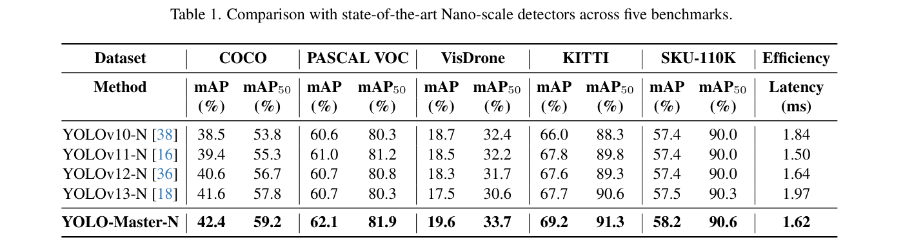

表中 YOLO-Master-N 在全部五个数据集上同时取得最高的 mAP 与 mAP50，其中增益最大的 VisDrone 达 +2.1%、KITTI 达 +1.5%，可见自适应专家路由对小目标检测与精确定位的收益最明显；在平均 147 个目标/图的 SKU-110K 上取得 58.2% mAP，表明密集拥挤场景下专家特化依然有效。精度-延迟权衡如下图所示。

图中 YOLO-Master-N 位于 Pareto 前沿左上角（42.4%，1.62 ms），比 YOLOv13-N 快 17.8%，仅比最快的 YOLOv11-N 慢 8%，说明精度提升没有以牺牲实时性为代价。

### 消融实验

ES-MoE 放置位置的消融如下表所示。

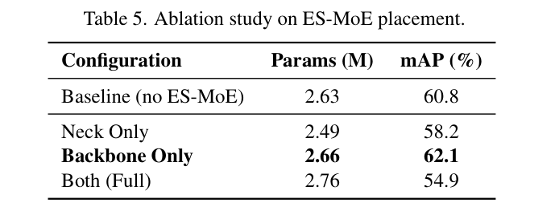

表中只放骨干时达到 62.1% mAP（+1.3%），只放颈部退化到 58.2%，骨干颈部同时插入更是恶化到 54.9%，可见级联路由在反向传播中产生相互冲突的路由梯度，更多 ES-MoE 并不保证更好性能，本文据此采用仅骨干的默认配置。专家数量的消融如下表所示。

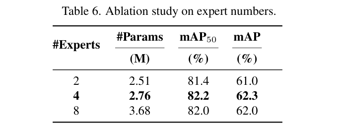

表中 4 专家以 2.76M 参数取得 62.3% mAP 的最优平衡，2 专家因容量不足掉到 61.0%，8 专家无收益还使参数增加 33%，说明适度的专家多样性已足以覆盖多尺度变化。top-K 的消融如下表所示。

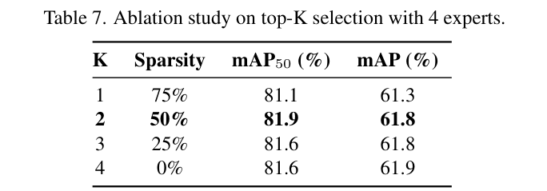

表中 $K=2$ 在 50% 稀疏度下取得最优的 61.8% mAP，$K=1$ 因表征不足低 0.5%，$K$ 继续增大则收益消失，两个互补专家即可兼顾特征多样性与计算效率。损失配置的消融如下表所示。

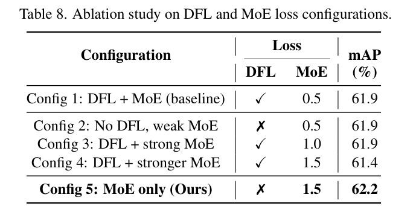

表中 Config 5（去掉 DFL、仅用权重 1.5 的 MoE 损失）以 62.2% mAP 最优，而 DFL 与强 MoE 并存的 Config 4 最差，训练曲线也呈现剧烈震荡，具体对比如下图所示。

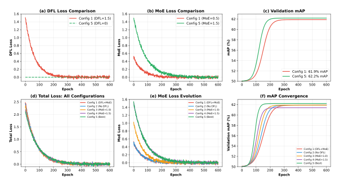

图中 Config 4 的损失曲线大幅振荡而 Config 5 平滑收敛，可见 DFL 强制的均匀分布精炼与 MoE 损失鼓励的实例自适应专家特化存在梯度竞争，移除 DFL 后 MoE 损失同时承担回归引导与专家特化，训练更稳定。

### 下游任务泛化

把消融得出的最优配置迁移到检测、分类与分割三类任务，Small 规模检测对比如下表所示。

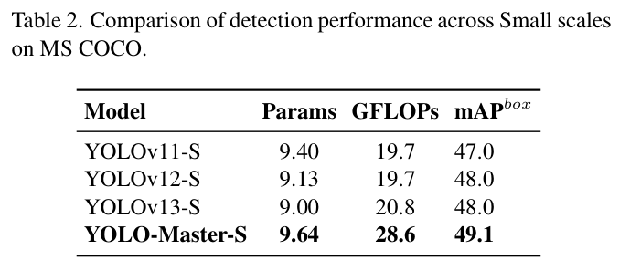

表中 YOLO-Master-S 取得 49.1% mAP，超过 YOLOv13-S 的 48.0%，可见容量动态分配的收益可以随模型规模放大。ImageNet 分类对比如下表所示。

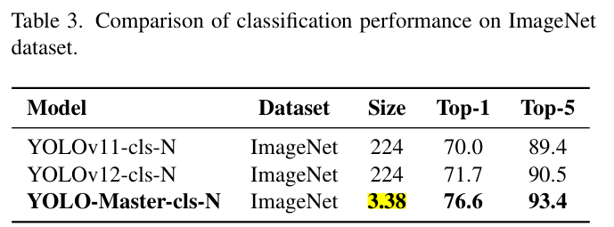

表中 YOLO-Master-cls-N 的 Top-1 达到 76.6%，比 YOLOv12-cls-N 高 4.9%，说明专家特化显著增强了骨干的特征表征能力。MS COCO 上的实例分割对比如下表所示。

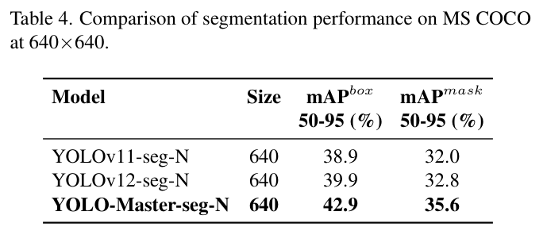

表中 mAP mask 达到 35.6%，比 YOLOv12-seg-N 高 2.8%，定位与掩码质量同步提升，三个任务的一致增益表明 ES-MoE 学到的骨干表征具备跨任务通用性。

### 可视化分析

四个挑战场景上的定性对比如下图所示。

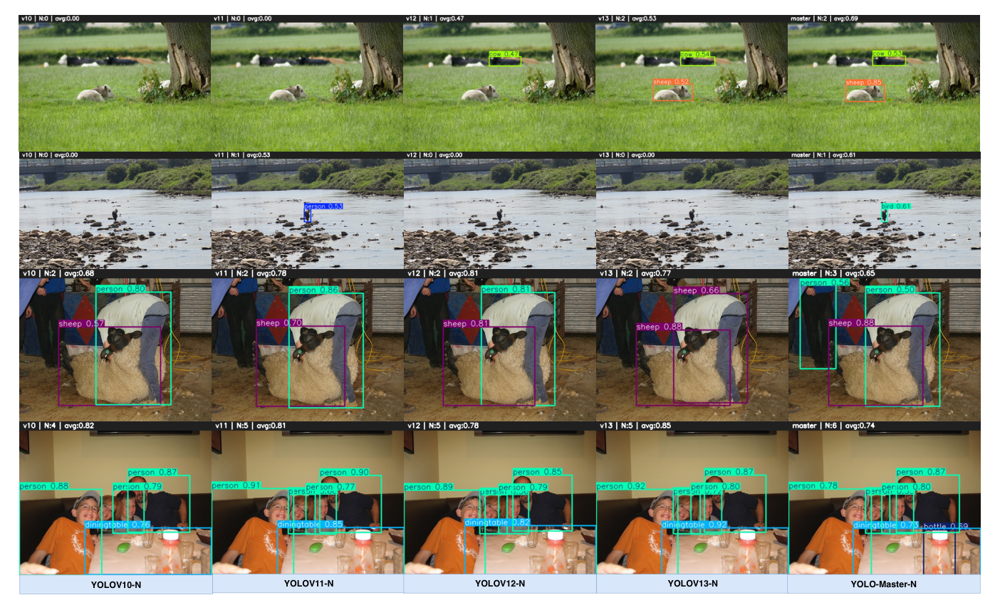

图中第一行草地小动物场景里，YOLOv12-N 置信度只有 0.47 而 YOLO-Master-N 达到 0.65-0.82；第二行海岸伪装场景中 v10-v12 漏检遮挡目标，YOLO-Master-N 给出精准定位；第三行剪毛场景的平均置信度为 0.85（v13 为 0.77）；第四行密集餐桌场景以 0.87-0.97 的高置信度补全了大量被漏检的小物件，可以看出 ES-MoE 的尺度自适应路由在难例上的优势能够稳定迁移到真实画面。

## 优点和创新点

个人认为，本文有如下一些优点和创新点可供参考学习：

1. 把混合专家条件计算引入实时目标检测，将静态的精度-效率权衡改造成按输入复杂度动态分配表征容量的可微机制，小目标与密集场景受益最明显（VisDrone +2.1%、KITTI +1.5%）。
2. 软/硬 Top-K 分阶段路由配合轻量门控：训练期掩码重归一化保住梯度流动，推理期严格稀疏换来真实加速，门控开销与分辨率无关，条件计算因此在 Nano 级模型上真正可部署。
3. 消融实验丰富且有指导意义：仅骨干放置 ES-MoE 最佳、双处插入因路由梯度冲突反而退化，MoE-only 损失替代 DFL 有训练曲线佐证，五基准加三类下游任务的覆盖说服力强。
